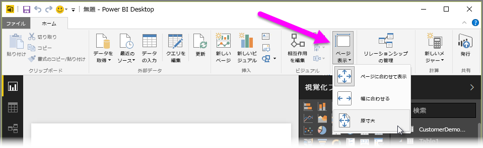
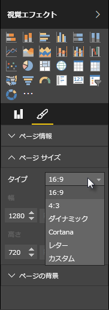

Power BI Desktop では、サイズや向きなど、レポート ページのレイアウトと書式を制御できます。

レポート ページをスケーリングする方法を変更するには、[ホーム] タブの **[ページ表示]** メニューを使用します。 使用できるオプションには、**\[ページに合わせて表示]** \(既定)、**[ページの幅に合わせて表示]**、**[原寸大]** があります。

ページ自体のサイズを変更することもできます。 既定では、レポート ページは 16:9 の割合になっています。 ページ サイズを変更するには、ビジュアルが選択されていないことを確認したうえで、[Visualizations (視覚化)] ウィンドウで [paintbrush (ペイントブラシ)] アイコンを選択し、**[ページ サイズ]** を選択してセクションを拡張します。

サイズのオプションには、\[4:3] \(より正方形に近いアスペクト比) や、\[ダイナミック] \(使用できるスペースに合わせてページが拡張されます) があります。 また、レポート用に標準レター サイズも用意されています。 ページ サイズを変更した後は、すべてのビジュアルがキャンバス上に表示されるようにビジュアルのサイズを変更することが必要になる場合があります。

カスタムのページ サイズを指定することもできます。その場合は、インチまたはピクセル単位でサイズを設定し、レポート全体の背景色を変更します。

もう 1 つのオプションとして [Cortana] を選択できます。この場合、Cortana を使用した検索の結果として使用できるようにレポートのサイズが変更されます。

