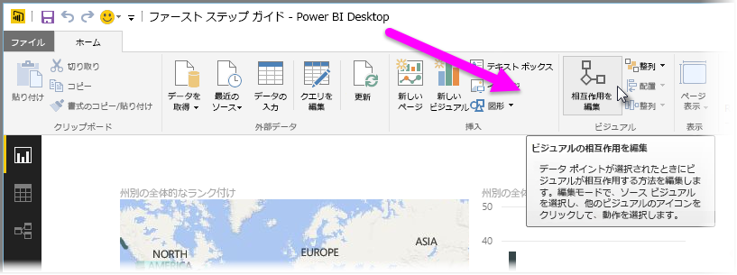
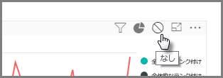
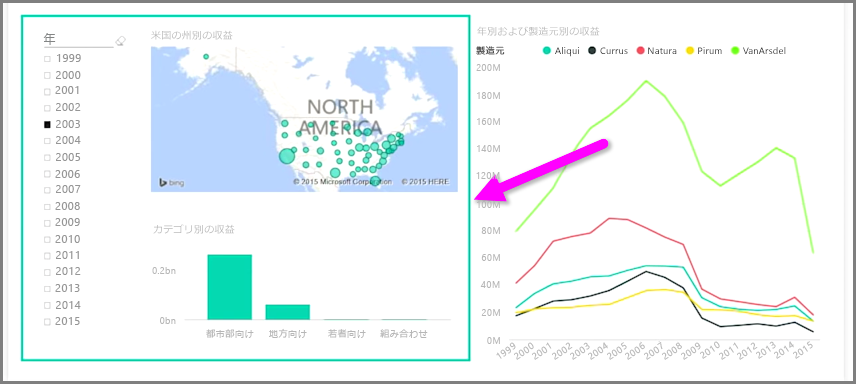

同じレポート ページ上に複数の視覚エフェクトがある場合は、クリックするかスライサーを使用して特定のセグメントを選択すると、そのページ上のすべてのビジュアルが影響を受けます。 ただし、特定のビジュアルのみを対象にスライス処理を行う方が適切である場合もあります。 これは、特定のセグメントにデータを制限すると重要な意味が失われてしまう散布図などの要素を使用しているときに特に当てはまります。 Power BI Desktop には、ビジュアル間の相互作用を制御する機能もあります。

視覚エフェクト間の相互作用を変更するには、**[ホーム]** リボンの [ビジュアル] セクションで **[編集]** を選択して**編集モード**をオンにします。

>[!NOTE]
>Power BI Desktop の **[相互作用を編集]** アイコンは、このビデオが録画された後で変更されています。
> 
> 

レポート キャンバスでビジュアルを 1 つ選択すると、影響を受ける他のすべてのビジュアルの右上隅に小さな不透明の*フィルター* アイコンが表示されます。 ビジュアルを相互作用から除外するには、右上隅の*フィルター* アイコンの近くにある *[なし]* シンボルをクリックします。

場合によっては、ビジュアル間のフィルター相互作用の種類を調整することもできます。 **編集モード**がオンになっている状態で、フィルター処理に使用するビジュアルを選択します。 別のビジュアルの種類を変更できる場合は、*円グラフ* アイコンが右上隅のフィルターの横に表示されます。

セグメント化されたデータを強調表示するには、*円グラフ* アイコンをクリックします。 それ以外の場合、データはフィルター処理されます。 既に説明したように、*[なし]* アイコンをクリックすると、すべての相互作用が削除されます。

デザイン上の有益な手法として、相互にやり取りするビジュアルの周囲に透過的な図形を描画してこれらのビジュアルの間に対話関係があることをユーザーにわかりやすくすることをお勧めします。

