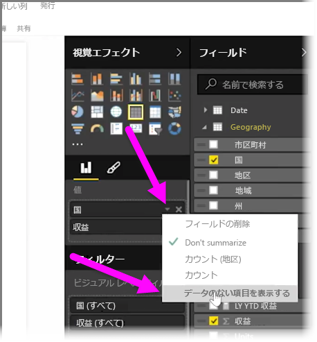
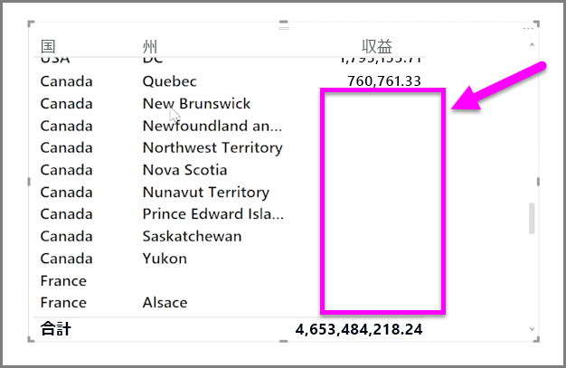

既定では、列の見出しが表示されるのは、レポートにデータが含まれている場合のみです。 たとえば、国別の売上を表示していて、ノルウェーの売上がない場合、ノルウェーは視覚エフェクトのどこにも表示されません。

空のカテゴリを表示するには、**[視覚エフェクト]** ウィンドウで変更するフィールドの下向き矢印をクリックして、**[データのない項目を表示する]** を選択します。

これで、空の列が空白の値を持つビジュアルに表示されます。

**[視覚エフェクト]** ウィンドウで、あるフィールドの **[データのない項目を表示する]** を選択すると、[視覚エフェクト] ウィンドウに表示されるすべてのフィールドに適用されます。 したがって、別のフィールドを追加すると、データがない項目も表示されるため、ドロップダウン メニューを再確認する必要はありません。

