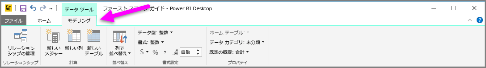
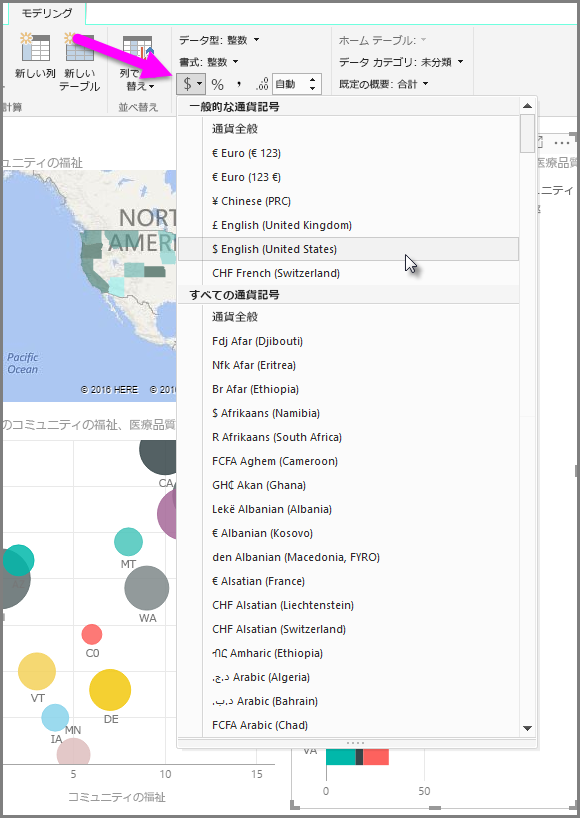
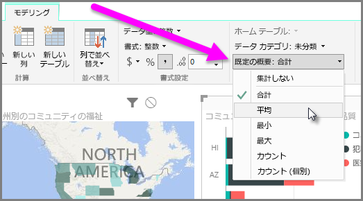
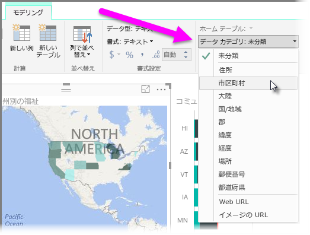

Power BI では、モデル内のフィールドにプロパティを割り当てることができます。これにより、レポートを容易に作成し、よりわかりやすい形式でデータを視覚化および表示できます。 たとえば、数字のリストの平均を必要としているにもかかわらず Power BI によってリストの合計が自動的に計算されることがあります。 Power BI では、これらの数字のリストの集計方法を調整できます。

## 数値の集計コントロール
ここでは、例を使いながら、Power BI で数値データ フィールドがどのように制御されるかについて説明します。

レポート キャンバス上のビジュアルを選択し、**[フィールド]** ウィンドウでフィールドを選択します。 リボンに **[モデリング]** タブが表示され、データの書式およびプロパティを設定するためのオプションが表示されます。

使用する通貨記号を選択するには、次の図に示すように、通貨記号ボックスの一覧から目的の通貨記号を選択します。

フィールドの書式設定用のオプションも数多く用意されています。 たとえば、通貨からパーセンテージに書式を変更することができます。

Power BI でデータを集計する方法を変更することもできます。 **[既定の概要]** アイコンを選択して、合計、カウント、平均の表示方法など、フィールドの集計方法を変更できます。

## 場所データの管理および明確化
地図上に場所を描画するときに類似する変更を加えることができます。 地図を選択し、**[フィールド]** ウィンドウで、*[場所]* の値に使用するフィールドを選択します。 **[モデリング]** タブで、**[データ カテゴリ]** を選択し、場所データを表すカテゴリをドロップダウン メニューから選択します。 たとえば、"都道府県"、"郡"、または "市区町村" を選択します。

