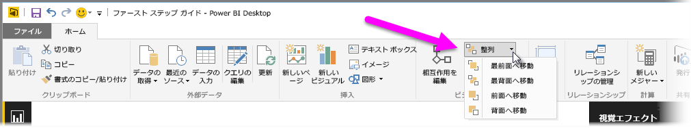
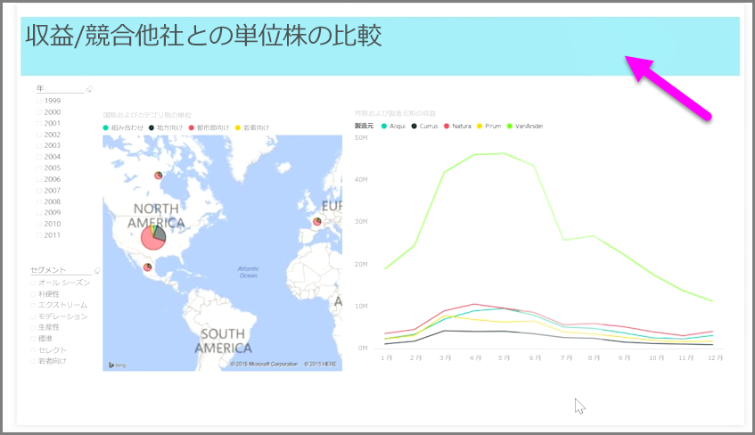

レポートの要素がたくさんある場合、Power BI では、それらを相互に重ねる方法を管理できます。 項目を階層化したり別の項目の上に配置する方法は、しばしば Z オーダーと呼ばれます。

レポート内の要素の Z オーダーを管理するには、要素を選択し、リボンの **[ホーム]** タブにある **[配置]** ボタンを使用して重ね順を変更します。

**[配置]** ボタンのメニューを使用すると、要素の順序を思いどおりの方法でレポートに取得できます。 ビジュアルを 1 レイヤー分だけ前方または後方に移動したり、オーダーの最背面または最前面に送ることができます。

装飾用の背景や罫線として図形を使用する場合や、個々のチャートやグラフの特定のセクションを強調表示する場合は、特に [配置] ボタンの使用が役立ちます。 このボタンは、レポート タイトルの背景に使用されている次の水色の四角形など、背景を作成するのにも使用できます。

