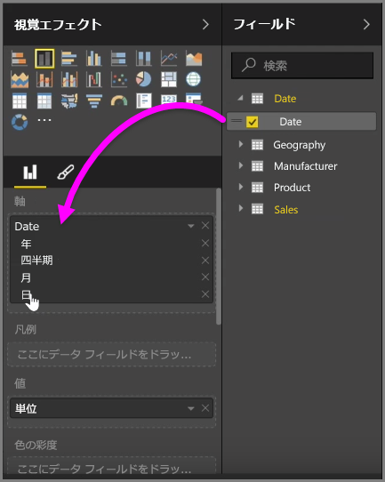
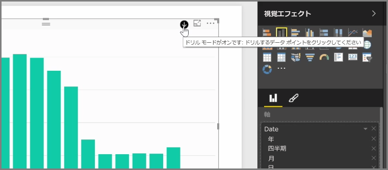
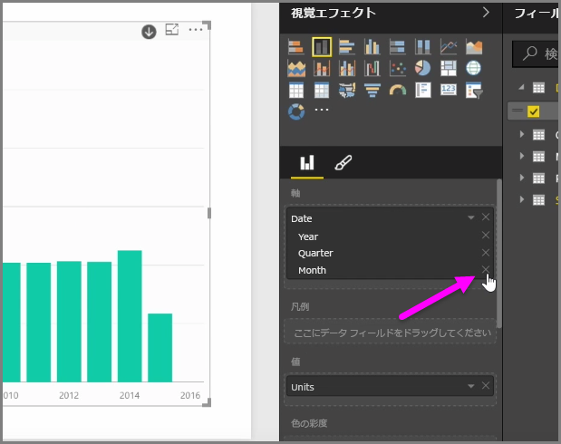
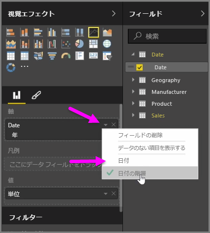
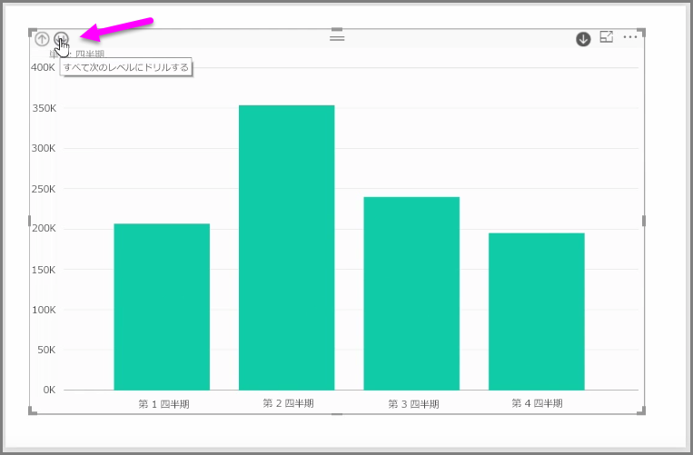

*[軸]* フィールド バケットのビジュアルに *[日付]* フィールドを追加すると、*[年]*、*[四半期]*、*[月]*、*[日]* を含む時間階層が Power BI によって自動的に追加されます。 これにより、ユーザーはこれらの異なる時間レベルにドリルダウンできるため、ビジュアルとレポートを表示するユーザーとの時間ベースの対話が可能になります。

階層が設定されたことで、時間の階層をドリルダウンできるようになります。 たとえば、グラフ内の年をクリックすると、階層の次のレベル (この例では *[四半期]*) にドリルダウンされ、ビジュアルに表示されます。

この自動的に作成された階層では、共有レポートをユーザーがドリルダウンできるレベルを管理することもできます。 そのためには、[Visualizations (視覚化)] ウィンドウで、削除する階層の横の [X] をクリックします。 削除したレベルはレポートから削除され、ドリルダウンによってそのレベルを表示することはできなくなります。

再びその階層レベルが表示されるようにするには、*[日付]* フィールドをいったん削除した後、**[フィールド]** ウィンドウからもう一度追加します。これで、階層がもう一度自動的に作成されます。

階層をビジュアルに使用しない方がよい場合もあります。 その場合は、(ビジュアルに追加した) *[日付]* フィールドの横にある下向きの矢印ボタンを選択し、**[日付の階層]** ではなく **[日付]** を選択します。 これにより、生の日付値がビジュアルに表示されるようになります。

四半期または年を個別に選択する代わりに、現在表示されているすべてのデータ要素を一度に展開することもできます。 そのためには、左上にある、二重の下向き矢印で示された *[Drill All (すべてドリル)]* アイコンを選択します。

