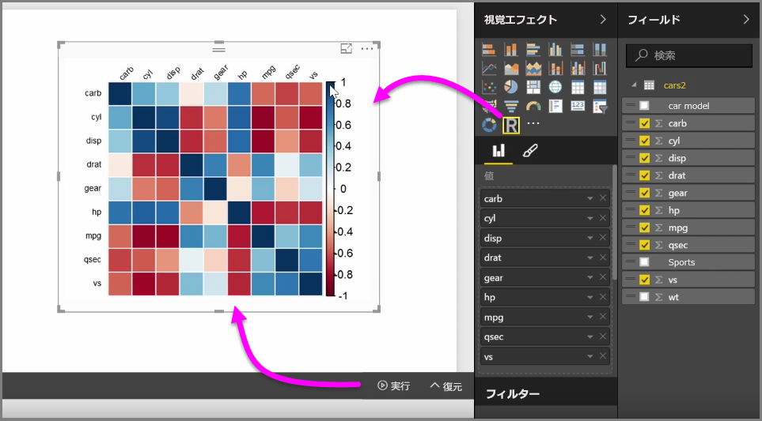
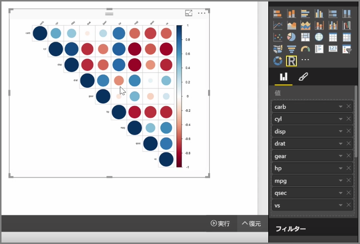

Power BI desktop では、解析や統計的分析を実行し、R と統合することで説得力のあるビジュアルを作成できます。これらの R 視覚エフェクトは、Power BI Desktop レポート内でホストできます。

**[視覚エフェクト]** ウィンドウで **R ビジュアル**のアイコンを選択すると、Power BI が R ビジュアルをホストするキャンバスにプレース ホルダーを作成し、キャンバスで使用する R スクリプト エディターが表示されます。 R ビジュアルにフィールドを追加すると、Power BI Desktop はそれらを R スクリプトのエディター ウィンドウに追加します。

Power BI が R スクリプト エディターで生成した内容の下で、R スクリプトの作成を開始してビジュアルを生成できます。 スクリプトが完了して **[実行]** を選択すると、次のようになります。

1. ( **[フィールド]** ウィンドウの) ビジュアルに追加されたデータが、Power BI Desktop から R のローカル インストールに送信される
2. Power BI Desktop の R スクリプト エディターで作成したスクリプトが、その R のローカル インストールで実行される
3. Power BI Desktop が R のインストールから再度ビジュアルを取得し、それをキャンバスに表示する

これらの処理がすべて迅速に行われ、結果がキャンバスの **R ビジュアル**視覚エフェクトに表示されます。

R ビジュアルを変更するには、R スクリプトを調整してから **[実行]** を再度選択します。 次の図では、正方形ではなく円を表示するようにビジュアルを変更しています。

R ビジュアルは Power BI Desktop の他のビジュアルと同様なので、キャンバス上の他のビジュアルの操作や接続も同じようにできます。 フィルター処理や強調表示により、キャンバス上の他のビジュアルを操作すると、R ビジュアルが Power BI の他のビジュアルと同じように自動的に反応するため、R スクリプトを調整する必要はありません。

Power BI Desktop に備わった R の機能を活用することをお勧めします。

## 次の手順
**お疲れ様でした。** Power BI の**ガイド付き学習**コースの「**視覚エフェクト**」セクションが完了しました。 これで皆さんは、Power BI で提供されるさまざまな視覚エフェクトに精通し、それらの視覚エフェクトを使用、変更、カスタマイズする方法についても理解したことでしょう。 そして幸運にも、視覚エフェクトは基本的に Power BI Desktop と Power BI サービスで同じなので、学習した内容は両方に適用されます。

クラウドの説明に進み、Power BI サービスに専念する準備はこれで完了です。ここでは**データを探索**できます。 ご存知のとおり、作業の流れは次のようになります。

* **Power BI Desktop** にデータを取り込み、レポートを作成します。
* Power BI サービスに発行し、そこで新しい**視覚エフェクト**を作成したりダッシュボードを構築します。
* 他のユーザー、特に外出中のユーザーとダッシュボードを**共有**します。
* 共有したダッシュボードとレポートを、**Power BI Mobile** アプリで表示して操作します。

レポートを作成するのか、表示して操作するだけなのかに関係なく、これらすべての優れたビジュアルの作成方法や、データへの接続方法については、既に理解しています。 次に、これらのビジュアルとレポートを実際に見ていきましょう。

次のセクションをご覧ください。

