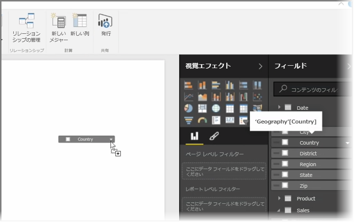
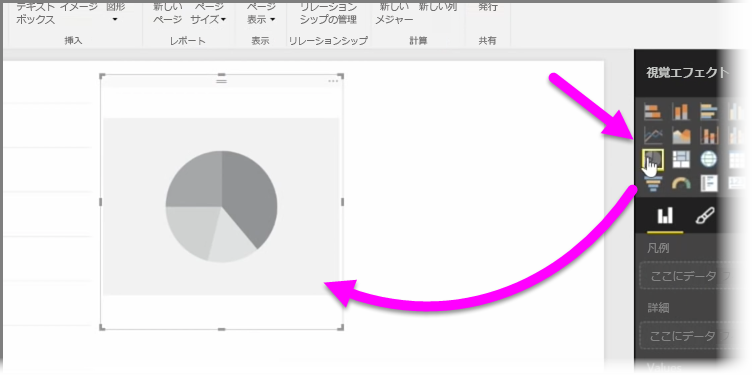
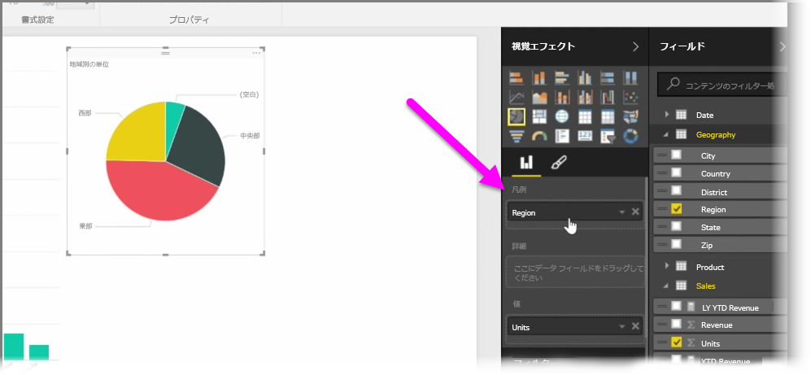
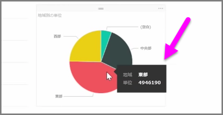
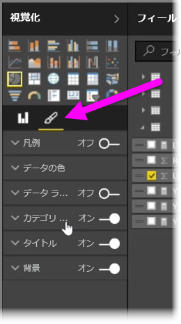

この記事では、新しい棒グラフ、円グラフ、ツリーマップの作成方法と、レポートに合わせてそれらをカスタマイズする方法を学習します。

Power BI Desktop で新しい視覚エフェクトを作成する方法は、次の 2 種類です。

* **[フィールド]** ウィンドウからレポート キャンバス上にフィールド名をドラッグ アンド ドロップします。 既定では、視覚エフェクトはデータのテーブルとして表示されます。
  
  
* **[視覚エフェクト]** ウィンドウで、作成する視覚エフェクトの種類をクリックすることもできます。 この方法の場合、既定のビジュアルは、選択したビジュアルの種類と似た空のプレース ホルダーです。
  
  

グラフ、マップ、チャートを作成すると、 **[視覚エフェクト]** ウィンドウの下の部分にデータ フィールドをドラッグし、ビジュアルを作成、編成できるようになります。 使用できるフィールドは、選択した視覚エフェクトの種類に応じて変わります。 データ フィールドをドラッグ アンド ドロップすると、視覚エフェクトが自動的に更新されて変更が反映されます。

視覚エフェクトのサイズを変更するには、視覚エフェクトを選択してハンドルを内側または外側へドラッグします。また、視覚化をクリック アンド ドラッグして、キャンバス上の任意の場所に移動することもできます。 種類の異なる視覚エフェクトの間で変換する場合は、変更するビジュアルを選択し、 **[視覚エフェクト]** ウィンドウのアイコンから異なるビジュアルを選択するだけです。 Power BI は、選択したフィールドを新しいビジュアルの種類にできるだけ正確に変換しようとします。

視覚エフェクトの部分をポイントすると、ラベルと合計金額など、そのセグメントに関する詳細を含むツールヒントが表示されます。

**[視覚エフェクト]** ウィンドウで**ペイントブラシ**のアイコンを選択すると、背景の配置、タイトルのテキスト、データの色など、ビジュアルに表面的な変更を加えることができます。

ビジュアルの表面的な変更に使用できるオプションは、選択したビジュアルの種類によって異なります。

