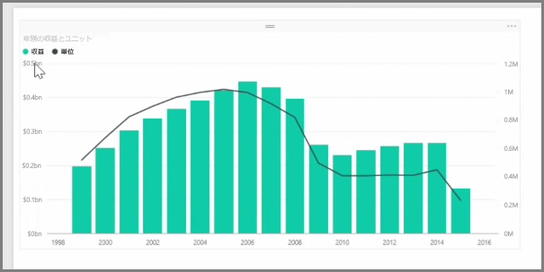
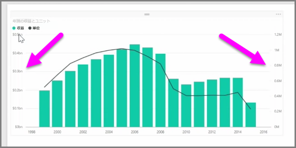
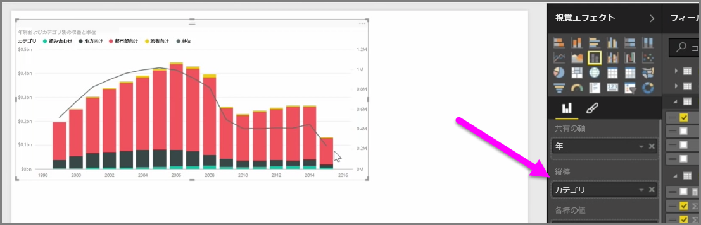

収益と単位など、非常に異なるスケールを適用する 2 つのメジャーを視覚化するとき、異なる軸のスケールで線やバーを表示する**複合グラフ**は非常に便利です。 Power BI は、一般的な**折れ線**グラフおよび**積み上げ縦棒**グラフを含む、さまざまな種類の複合グラフを既定でサポートしています。

複合グラフを作成するとき、 **[共有の軸]** (X 軸) フィールドが表示されます。その後、2 つのフィールドの値が示されます。この場合、列と行の値です。 視覚化のいずれかの側に、2 つの y 軸の凡例が表示されます。

[視覚エフェクト] ウィンドウで系列フィールドにカテゴリをドラッグすることで、縦棒をそれぞれカテゴリ別に分割することもできます。 このようにすると、各棒が、各カテゴリ内の値に基づいて、比例して色付けされます。

複合グラフは、非常に異なるスケールを持つ複数のメジャーを、1 つのビジュアル化で視覚化することに効果的な方法です。

