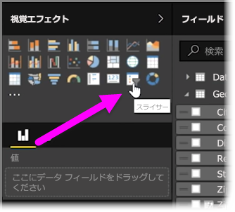
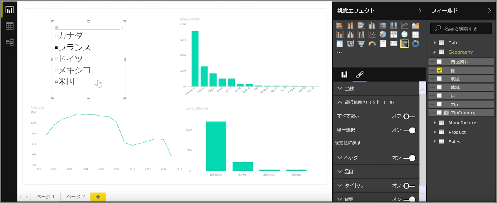
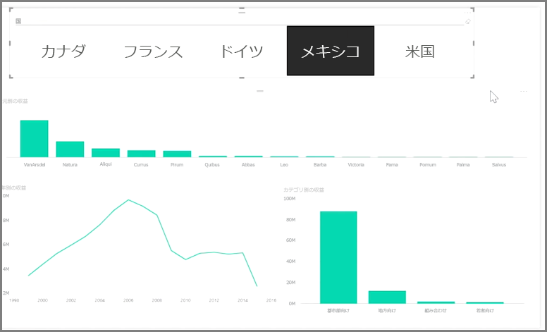

スライサーは、最も強力なタイプの視覚エフェクトの 1 つで、特にビジー レポートでよく使用されます。 **Power BI Desktop** で**スライサー**は、レポートを見るだれもが特定の値 (年や地理的場所など) でデータをセグメント化できるようにする、キャンバス上の視覚フィルターです。

レポートにスライサーを追加するには、**[Visualizations (視覚化)]** ウィンドウから **[スライサー]** を選択します。

スライスするフィールドをドラッグしてスライサー プレースホルダーにドロップします。 視覚エフェクトが、チェック ボックスを持つ要素の一覧に変わります。 これらの要素がフィルターになります。セグメント化する要素の横のチェック ボックスをオンにすると、同じレポート ページ上の他のすべての視覚エフェクトにもこのフィルターが適用されます (選択内容に従って*スライス*されます)。

スライサーの書式設定用にいくつかのオプションが用意されています。 一度に複数の入力を受け取るように設定できます。また、一度に 1 つずつ使用するように **[単一選択]** モードを切り替えることもできます。 **[すべて選択]** オプションをスライサー要素に追加することもできます。これは、特に長いリストがある場合に便利です。 既定の垂直方向から水平方向にスライサーの向きを変更すると、チェックリストではなく選択バーになります。

