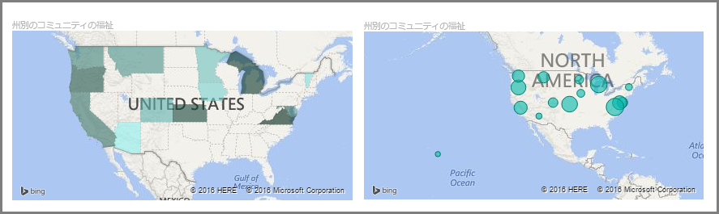
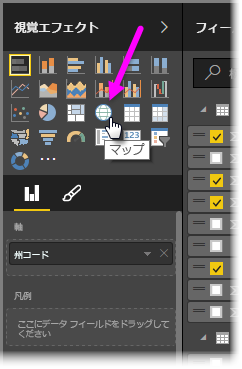
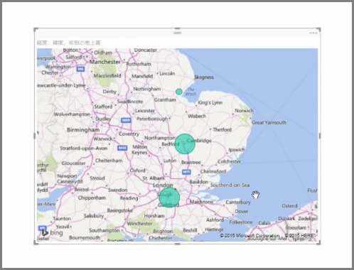
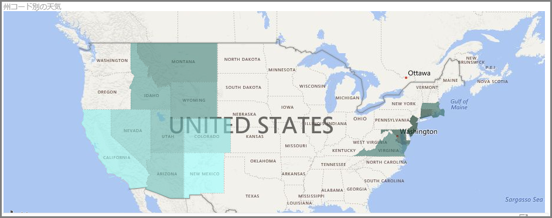
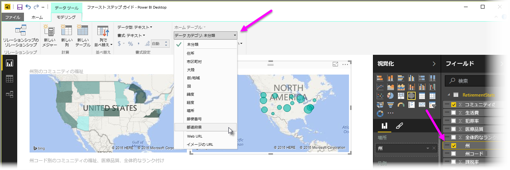

Power BI には、地理上のポイントにバブルを配置するバブル マップと、実際に視覚化する領域のアウトラインを表示する図形マップという、2 種類の視覚エフェクトマップがあります。

> [!NOTE]
> 国または地域を扱うとき、3 文字の省略形を使用し、マップ視覚エフェクトでジオコーディングが正しく機能するようにします。 2 文字の省略形は *使用しない* でください。正しく認識されない国や地域があります。
> 省略形が 2 文字しかない場合、[この外部ブログ投稿](https://blog.ailon.org/how-to-display-2-letter-country-data-on-a-power-bi-map-85fc738497d6#.yudauacxp)を参照してください。2 文字の国/地域コードを 3 文字の国/地域コードに関連付ける方法が紹介されています。
> 
> 

## バブル マップを作成する
バブル マップを作成するには、**[視覚エフェクト]** ウィンドウで **[マップ]** オプションを選択します。 マップのビジュアルを使用するには、**[視覚エフェクト]** オプションの *[地域]* バケットで値を追加する必要があります。

Power BI では、市区町村名や空港コードのような一般的な詳細から、非常に具体的な緯度と経度のデータまで、地域の値の種類を柔軟に許可します。 マップの地域ごとにバブルのサイズを変更するには、**[サイズ]** バケットにフィールドを追加します。

## 図形マップを作成する
図形マップを作成するには、[視覚エフェクト] ウィンドウで **[塗り分け地図]** オプションを選択します。 バブル マップと同様に、このビジュアルを使用するには、[地域] バケットに何らかの値を追加する必要があります。 [サイズ] バケットにフィールドを追加すると、それに応じて塗りつぶしの色の濃さを変更できます。

ビジュアルの左上隅にある警告アイコンは、値を正確にプロットするには、マップにより多くの地域データが必要であることを示します。 これは、州または地域を示す *ワシントン* のような領域名を使用するなど、地域フィールド内のデータはがあいまいな場合によくある問題です。 この問題を解決する 1 つの方法として、*[都道府県]* のような具体的な列名に変更します。 この問題を解決する別の方法として、[モデリング] タブで **[データ カテゴリ]** を選択して、データ カテゴリを手動でリセットします。そこから [都道府県] や [市区町村] などのカテゴリをデータに割り当てることができます。

