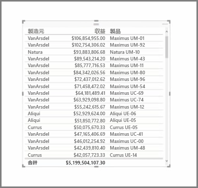
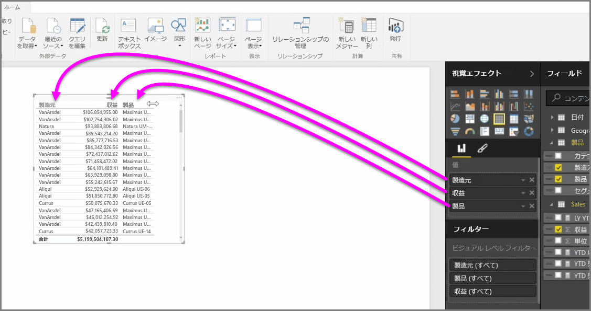
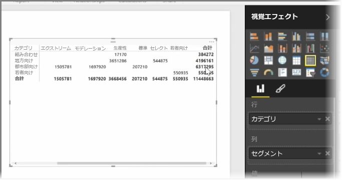

豊富なチャート以外にも、Power BI Desktop は、複数の表形式の視覚エフェクトをサポートしています。 実際には、カテゴリ別フィールドまたはテキスト フィールドをつかんでレポート キャンバスにドラッグすると、既定で結果のテーブルを取得できます。 テーブルを上下にスクロールすると、既定でアルファベット順に並べ替えられていることが分かります。

テーブルに収益などの数値情報がある場合、合計が下部に表示されます。 列のヘッダーをクリックして昇順または降順を切り替えることで、列ごとに手動で並べ替えることができます。 列にすべての内容を表示するだけの幅がない場合は、ヘッダーを横方向にクリック アンド ドラッグして拡大します。

**視覚エフェクト** ウィンドウの *[値]* バケットにあるフィールドの順序により、テーブルに表示される順序が決まります。

**マトリックス**はテーブルに似ていますが、行と列のカテゴリ ヘッダーが異なります。 テーブルと同様に、数値情報が自動的に合計されてマトリックスの下と右に表示されます。

列の自動サイズ調整、行と列の合計の切り替え、色の設定など、マトリックスに使用できる表面処理のオプションは多数あります。 マトリックスを作成する場合、カテゴリ データ (非数値データ) がマトリックスの左側にあり、数値ファイルが右側にあることを確認し、水平スクロール バーが表示され、そのスクロールが正常に動作することを確認してください。

