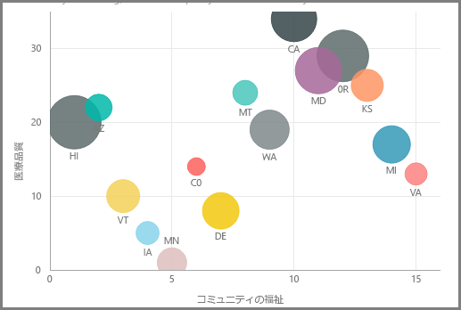
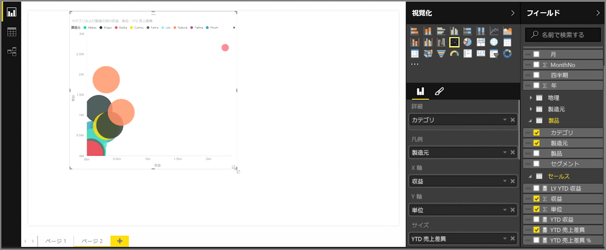
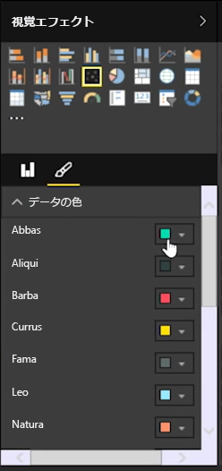
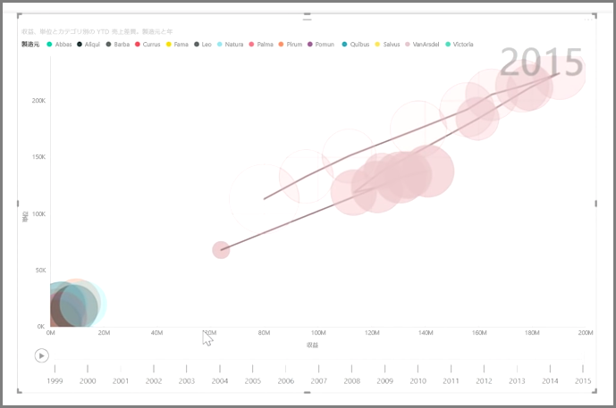

売上数量と収益などの 2 つの異なるメジャーを比較する場合、通常は視覚エフェクトとして散布図を使用します。

空のグラフを作成するには、**[Visualizations (視覚化)]** ウィンドウで **[散布図]** を選択します。 比較する 2 つのフィールドを **[フィールド]** ウィンドウから *[X 軸]* および *[Y 軸]* のオプション バケットにドラッグ アンド ドロップします。 この時点で、散布図にはビジュアルの中央に小さなバブルがあるのみです。データをセグメント化する方法を示すには、*[詳細]* バケットにメジャーを追加する必要があります。 たとえば、品目の売上と収益を比較するときに、カテゴリ、製造元、または販売月でデータを分割することが必要になる場合があります。

*[凡例]* バケットにフィールドを追加すると、フィールドの値に従ってバブルが色分けされます。 *[サイズ]* バケットにフィールドを追加して、値に従ってバブル サイズを変更することもできます。

散布図についても、数多くのビジュアル書式設定オプションが用意されています。たとえば、色分けされた各バブルのアウトラインをオンにしたり、個々の各ラベルを切り替えたりできます。 同様に、他の種類のグラフでデータの色を変更することもできます。

*[再生軸]* バケットに時間ベースのフィールドを追加すると、時間の経過に合わせて変化するバブル チャートのアニメーションを作成できます。 アニメーションの再生中にバブルをクリックすると、そのパスのトレースが表示されます。

>[!NOTE]
>散布図に表示されているバブルが 1 つのみの場合は、Power BI によってデータが集計されています。これは、既定の動作です。 表示されるバブルの数を増やすには、**[Visualizations (視覚化)]** ウィンドウで *[詳細]* バケットにカテゴリを追加します。
> 
> 

