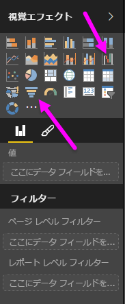
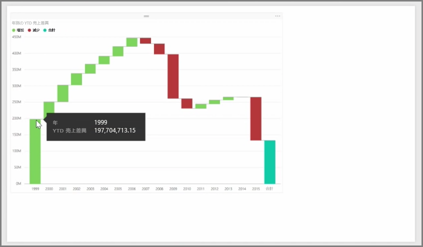
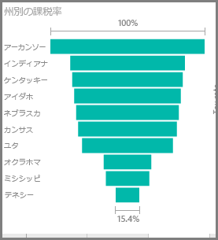

ウォーターフォール グラフとじょうごグラフは、Power BI に含まれる 2 つの興味深い (またあまり一般的ではない) 標準的な視覚エフェクトです。 どちらかのグラフを空の状態で作成するには、 **[視覚エフェクト]** ウィンドウでグラフのアイコンを選択します。

**ウォーターフォール グラフ**は、一般的に時間の経過に伴う特定の値の変更に使用します。

ウォーター フォール グラフには、2 つのバケットのオプションのみがあります。*カテゴリ*と*Y 軸*します。 *[年]* などの時間ベースのフィールドを *[カテゴリ]* バケットにドラッグし、追跡する値を *[Y 軸]* バケットにドラッグします。 既定では、値が増加した期間は緑色で、値が減少した期間は赤色で表示されます。

**じょうごグラフ**は、一般的に販売パイプラインや Web サイト保持の取り組みなど、特定のプロセスでの変更を表示する場合に使用します。

**ウォーターフォール** グラフと **じょうご** グラフは、どちらもスライスして視覚的にカスタマイズできます。

