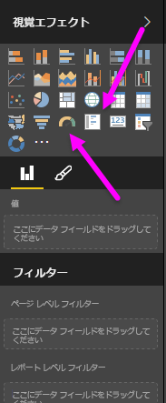
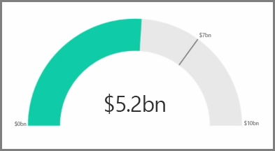
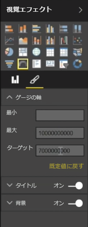
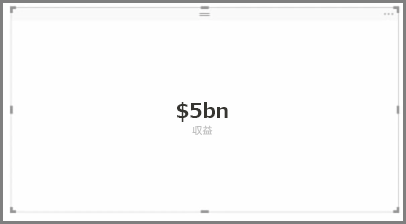
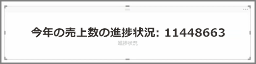

一般に、視覚エフェクトは 2 つ以上の異なる値を比較するのに使用します。 ただし、レポートを作成するときに、時間の経過に伴う主要業績評価指標 (KPI) やメトリックを 1 つだけ追跡する場合もあります。 Power BI Desktop でこのような処理を実行する方法が、**ゲージ** または **単一数値** カード ビジュアルの使用です。 どちらかのグラフを空の状態で作成するには、**[視覚エフェクト]** ウィンドウでグラフのアイコンを選択します。

ゲージは、ダッシュ ボードを作成するときに、特定のターゲットに対する進捗状況を表示する場合に特に便利です。 ゲージを作成するには、**[視覚エフェクト]** ウィンドウからアイコンを選択し、*[値]* バケットに追跡するフィールドをドラッグします。

ゲージは既定で 50% か *[値]* の 2 倍で表示されています。この設定を調整する方法は 2 つあります。 値を動的に設定するには、*[最小]*、*[最大]*、*[ターゲット]* のいずれかの [値] バケットにフィールドをドラッグします。 または、ビジュアルの書式設定オプションを使用して、ゲージの範囲を手動でカスタマイズします。

カードの視覚エフェクトは、フィールドを数値で表示しただけのものです。 カード ビジュアルの既定では、たとえば「$5,000,000,000」ではなく「$5bn」と表示するなど、数値を短くするための単位を使用します。 使用されている単位を変更したり完全に無効にするには、ビジュアルの書式設定オプションを使用します。

カードの 1 つの興味深いアプリケーションは、テキストと連結したカスタム メジャーの表示です。 前の例を使用するには、お使いのカードに高度な DAX 関数を含めることのできるカスタム メジャーを使用して「今年売上の合計: $5bn」や「今年の売上数量の進捗状況:」などを表示してから、進行状況を表す数値を追加します。

