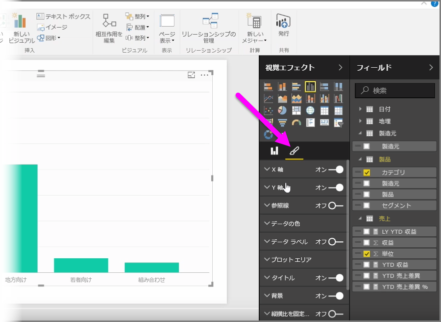
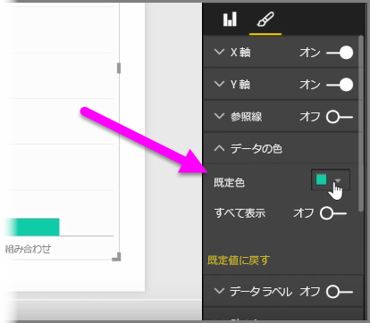
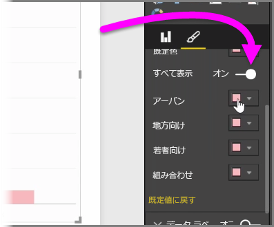
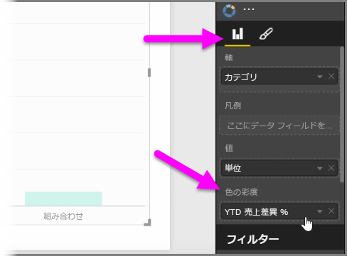
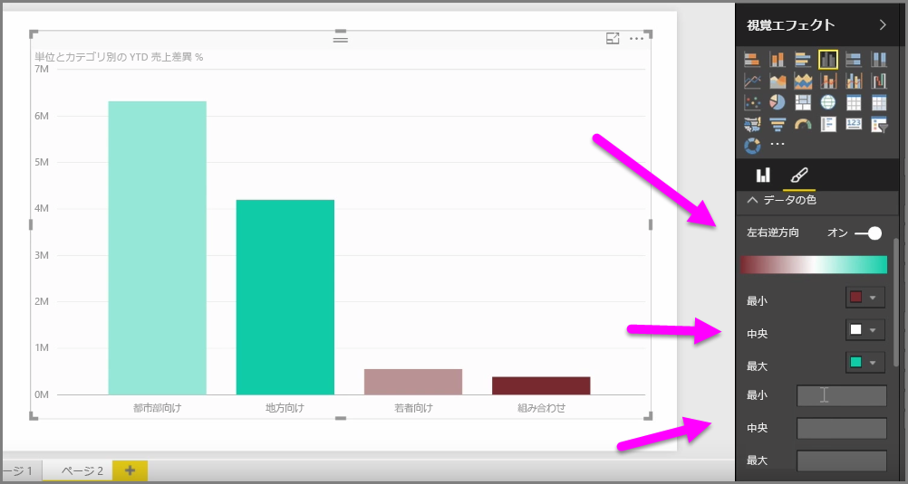
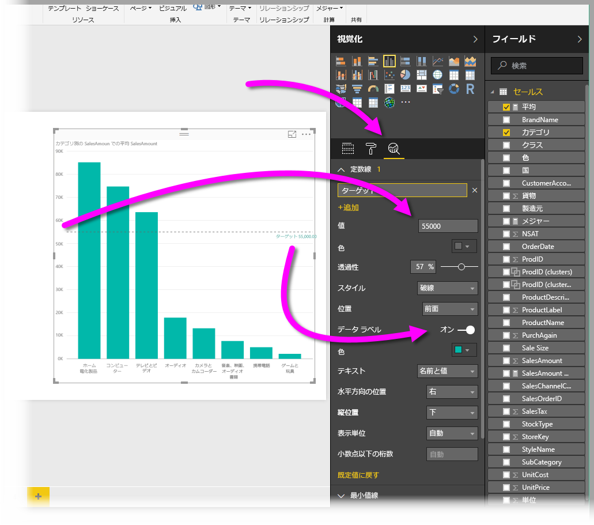
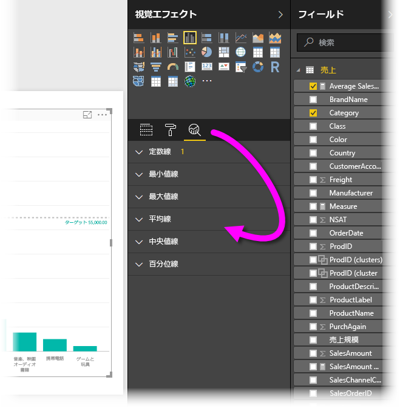

グラフやビジュアルに使用されている色を変更したい場合があります。 Power BI では、色の表示方法をさまざまな方法で制御できます。 最初に、ビジュアルを選択し、 **[Visualizations (視覚化)]** ウィンドウで **[paintbrush (ペイントブラシ)]** アイコンをクリックします。

ビジュアルの色または書式を変更するための多くのオプションがあります。 **[既定色]** の横のカラー ピッカーを選択し、目的の色を選択することで、ビジュアルのすべての棒の色を変更できます。

また、 **[すべて表示]** スライダーをオンに切り替えることで、それぞれの棒 (または、選択したビジュアルの種類に応じて他の要素) の色を変更できます。 この場合、それぞれの要素に対して色の選択ツールが表示されます。

また、値またはメジャーに基づいて色を変更することもできます。 そのためには、[Visualizations (視覚化)] ウィンドウの **[色の彩度]** バケットにフィールドをドラッグします (これは **[paintbrush (ペイントブラシ)]** セクションではなく **[field well (フィールド)]** セクションから利用できます)。

さらに、スケールとデータ要素を色で塗りつぶすときに使用する色とスケールを変更できます。 さらに、3 つの色の間で色をスケーリングする [左右逆方向] スライダーをオンに切り替えることにより、左右逆方向のスケールを選択することもできます。 さらに、グラフに表示される *[Minimum (最小)]* 値、 *[中央]* 値、 *[Maximum (最大)]* 値を設定することもできます。

たとえば、0 を超える値を特定の色に設定し、0 を下回る値を別の色に設定するなど、これらの値を使用してルールを作成できます。

色を使用する場合に便利なもう 1 つのツールは、*定数線* (*基準線*とも呼ばれます) を設定することです。 定数線の値や色を設定できるほか、基準線にラベルを含めるかどうかも設定できます。 定数線 (およびその他の挿入行) を作成するには、(虫眼鏡に似た) **[分析] ウィンドウ**を選択し、 **[基準線]** セクションを展開します。

ビジュアル用に作成できる線は他にも多数あり、 **[分析]** ウィンドウにも表示されます。たとえば、最小値線、最大値線、平均線、中央値線、百分位線などがあります。

最後に、個々の視覚エフェクトの周囲に境界線を作成し、他のコントロールと同様に境界線の色を指定することができます。

