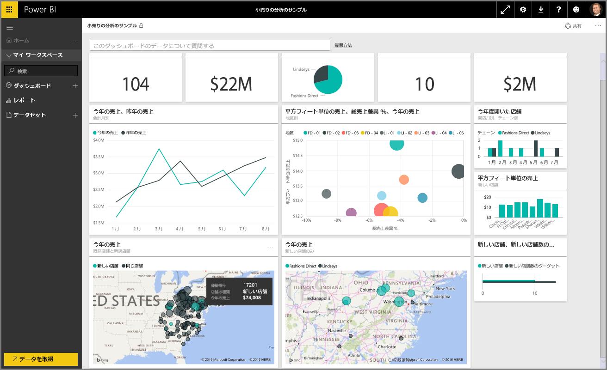

Power BI の**ガイド付き学習**コースの「**データの探索**」セクションへようこそ。 Power BI Desktop の概要とデータを取得および視覚化する方法について理解した後は、Power BI サービスでデータを探索してみましょう。

このセクションでさまざまな内容について学習することで、Power BI の魅力的な対話機能と共有機能を理解できます。 それでは、魅力的で興味深いセクションに向けて準備しましょう。

## Power BI サービスの概要
"*Power BI サービスがどのように組織に役立つかを知る*"

Power BI サービスは、**Power BI Desktop** の自然な発展形であり、レポートのアップロード、ダッシュボードの作成、自然言語を使用したデータの問い合わせなどの機能を含みます。 このサービスを使用して、データの更新時間の設定、組織とのデータの共有、カスタマイズされたサービス パックの作成などを行うことができます。

後続のトピックでは、Power BI サービスについて説明し、ビジネス インテリジェンス データをデータに関する洞察および共同作業による意思決定環境に利用する方法について説明します。

