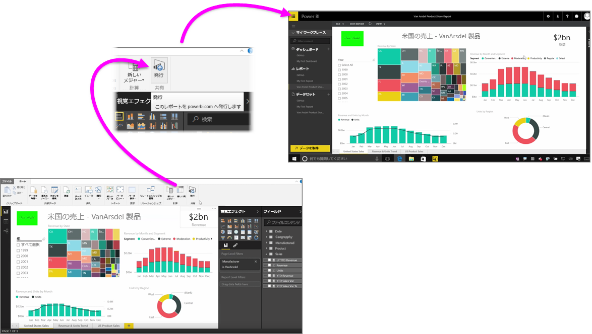

Power BI サービスへのレポートの発行は高速かつ簡単です。

**Power BI Desktop** でのレポート作成が完了したら、Power BI Desktop の **[ホーム]** タブで **[発行]** ボタンを選択するだけでプロセスが開始されます。

視覚エフェクト、クエリ、カスタム メジャーなどのデータとレポートがパッケージにまとめられ、Power BI サービスにアップロードされます。

> 注: Power BI Desktop レポートは、**.pbix** ファイル (Windows で与えられた拡張子) として参照するのが一般的です。
> 
> 

アップロードが完了したら、完了した発行の処理がダイアログ ボックスに表示され、Power BI サービスでレポートに直接移動できるそのダイアログへのリンクが、Web ブラウザーに表示されます。

このように、Power BI Desktop から Power BI サービスへのレポートの発行は簡単です。

