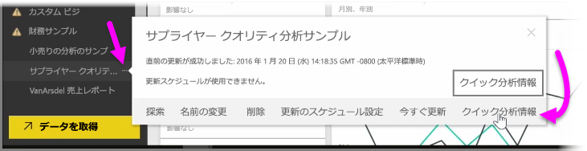
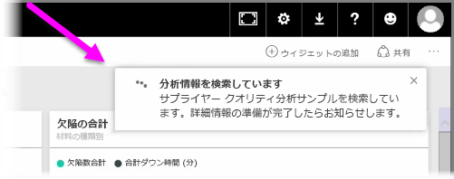
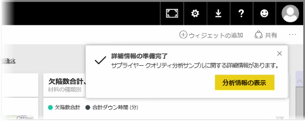
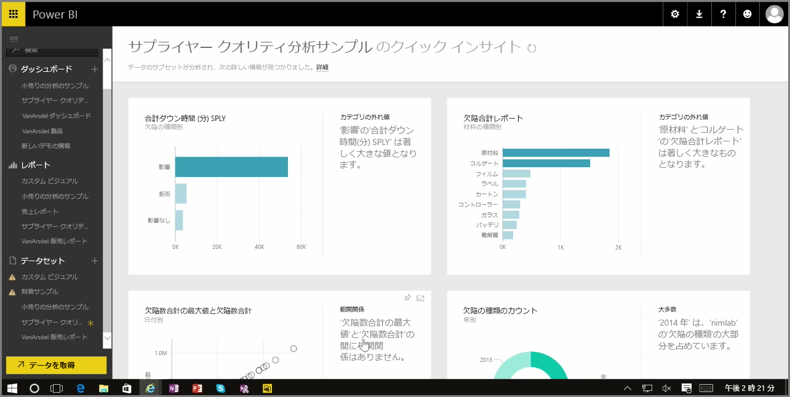

Power BI サービスでダッシュボード、レポート、またはデータセットを操作するときに、データのクイック分析情報を取得できます。 Power BI で、左側のウィンドウの **[データセット]** セクションで、対象のデータセットの横にある*省略記号* (3 つのドット) を選択します。 オプションのメニューが表示されます。右端に、 **[クイック分析情報]** と呼ばれるオプションが表示されます。

[クイック分析情報] を選択すると、Power BI は、機械学習と検索を行ってデータを分析し、クイック分析情報を取得します。 Power BI がインサイトを分析している間、サービスの右上隅にその旨を示す通知が表示されます。

15 秒ほど経過すると、その通知は、Power BI によってインサイトが取得されたことを示す通知に変わります。

通知の **[詳細情報の表示]** ボタンを選択すると、次の図のように、Power BI によって検出された洞察がビジュアルに示されたページが開きます。 ここにはたくさんの洞察が表示されています。ページを下へスクロールして、これらの情報を表示および確認します。

他のビジュアルと同様に、クイック分析情報ページのビジュアルは対話的に操作できます。また、ダッシュボードにこれらのビジュアルをピン留めしたり、1 つまたは複数の (または任意の数の) ビジュアルをフィルター処理して、好奇心から発見される可能性のある追加の洞察を検索したりできます。

**[クイック分析情報]** を使用すると、データの外れ値や傾向を見つける作業を Power BI に任せ、これらの分析結果をダッシュボードで使用できます。また、これらの分析結果をさらに絞り込んで、最も重要な洞察を得ることができます。

