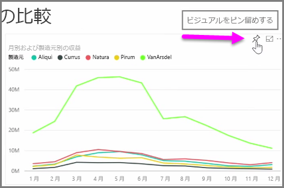
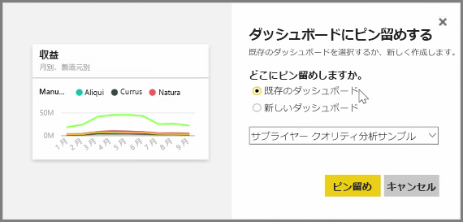
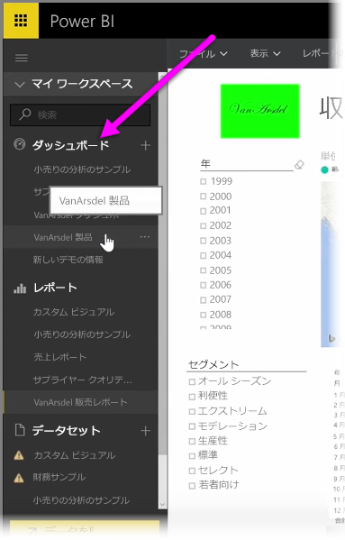
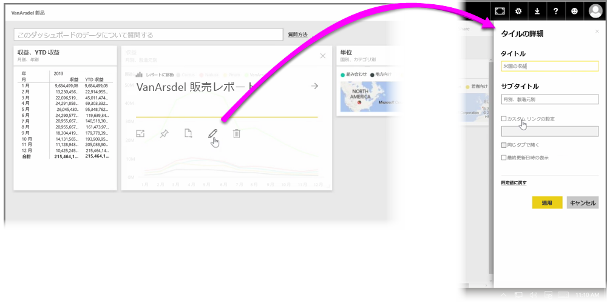

Power BI の**ダッシュボード**は、Power BI サービス内で作成した視覚エフェクトを 1 ページにまとめたものです。 ダッシュボードは、Power BI Desktop を使用して作成、公開したレポートを基にした視覚エフェクトや、Power BI サービス内で作成した視覚エフェクトを**ピン留め**して作ります。 ビジュアルの**ピン留め**は、壁に下げたコルクボードに写真を貼り付ける場合と同じです。好みの場所にビジュアルを貼り付けて他のユーザーが見やすいようにアレンジします。 ビジュアルをピン留めするには、Power BI サービスでレポートを開きます。 ピン留めするタイルにポインターを合わせ、**ピン** アイコンを選びます。

ダイアログ ボックスが表示されます。ドロップダウン メニューから、ビジュアルをピン留めするダッシュボードを選ぶことも、新しいダッシュボードを作成することもできます。 また、ダッシュボードにピン留めされたビジュアルの外観をプレビューすることもできます。 1 つのダッシュボードに複数のレポートやページからの視覚エフェクトをピン留めできるため、1 つの洞察ページにさまざまなデータセットやソースをまとめることができます。

**ダッシュボード**では、グラフ、マップ、画像、図形などのあらゆる種類の視覚エフェクトを「ピン留め」して追加することができます。 ビジュアルをダッシュボードにピン留めしたものを**タイル**と呼びます。

新規に作成したものも含め、ダッシュボードは Power BI サービスの左側にある [ダッシュボード] セクションに表示されます。 表示するには、一覧からダッシュボードを選びます。

ダッシュボードでのビジュアルのレイアウトは自由に変更できます。 タイルのサイズを変更するには、ハンドルをドラッグします。タイルを移動するには、クリックしてダッシュボードの別の場所にドラッグします。 タイルにポインターを合わせて**鉛筆**アイコンをクリックすると **[タイルの詳細]** が開き、 **[タイトル]** や **[Subtitle]** を変更できます。

基になったレポートを表示するには、ダッシュボードのタイルをクリックします。 これにより、ビジュアルの基になったデータをすばやく確認できます。 **[タイルの詳細]** の **[カスタム リンクの設定]** フィールドを使用して、そのリンクを変更することもできます。

複数のダッシュボードをまとめたダッシュボードを作成する場合などは、ピン留めしたタイルを他のダッシュボードに移動することができます。 手順は同じで、タイルにポインターを合わせて**ピン アイコン**を選びます。 ダッシュボードは作成も変更も簡単です。 また、カスタマイズして 1 ページのダッシュボードを作成し、提示するものを明確にすることができます。

