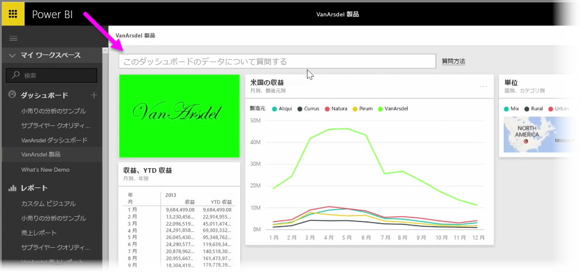
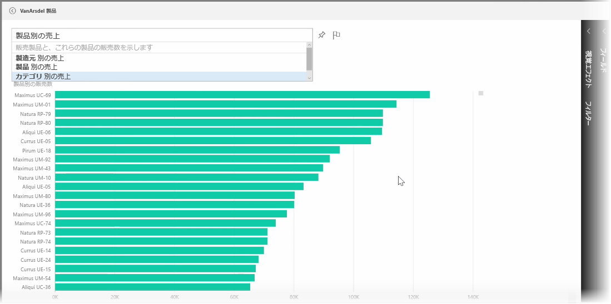
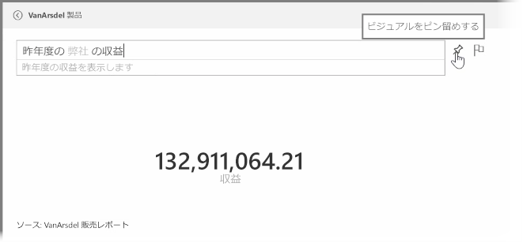
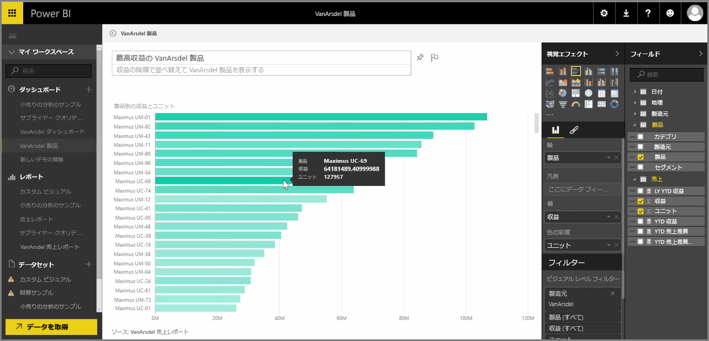

Power BI には、話し言葉や問いを使ってデータについての質問ができる、強力な言語認識エンジンが付属しています。 Power BI でレポートや視覚エフェクトを構築する際に、簡単な質問をするだけでチャートやグラフを作成することができます。

データの質問をするには、Power BI のダッシュボードを開き、画面上部の入力ボックスに、表示するデータについての質問を入力します。 この機能は*質問と回答*と呼ばれることも、単に **Q & A** と呼ばれることもあります (こちらのほうが一般的です)。

ボックスをクリックすると、Power BI がデータに基づき予測した用語 (「YTD 収益」など) をいくつか提示します。 提示された用語をクリックすると結果が表示されます。多くの場合、シンプルなテーブルかカード形式です。 提示されたフレーズのいずれかを選ぶと、Power BI は自動的に、選択に基づいたビジュアルをリアルタイムで作成します。

自然言語による質問をすることもできます。たとえば、「昨年の収益はどれくらいですか?」や 「2014 年 3 月に一番売れた製品は何ですか?」のように質問できます。 Power BI にあなたの質問を解釈した結果が表示されるので、最も適した答えを表すビジュアルを選びます。 Power BI の他のビジュアルと同じように、**ピン**アイコンを選ぶと、選んだダッシュボードに**ピン留め**することができます。

自然言語の質問やフレーズで作成されたビジュアルは、任意の時点で編集できます。 画面右側の **[視覚化]** ウィンドウと **[フィールド]** ウィンドウを使用します。 Power BI の他のビジュアルと同様に、レイアウトの変更やフィルターの調整、フィールドの入力値の変更ができます。

ビジュアルの作成が完了したら、質問入力ボックスの横にある**ピン**アイコンを選んで、視覚化されたビジュアルをダッシュボードに保存します。

