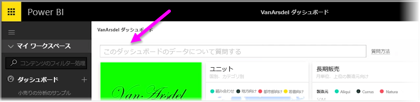
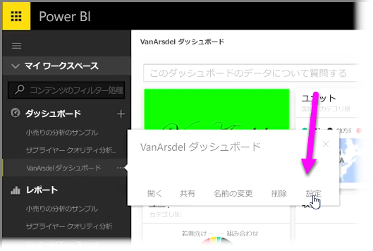
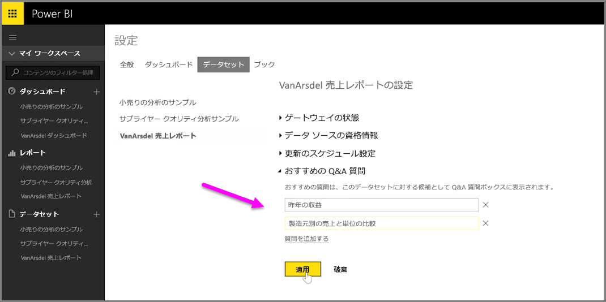

Power BI では、ダッシュボードで自然言語クエリ ボックス (通称 **Q&A** ボックス) を使用する他のユーザーのために、独自の質問を追加できます。 追加した質問候補は、ユーザーがダッシュボード上部の入力ボックスをクリックすると表示されます。

独自の質問を追加するには、使用するダッシュボードの名前の横にある省略記号 (...) を選び、メニューから **[設定]** を選択します。

 これにより、ダッシュボードに対する **[設定]** ページと、基になるデータセットまたはワークブックが開きます。 **[設定]** ページの **[ダッシュボード]** セクションで Q&A 検索入力ボックスを完全に無効にすることもできますが、ここでは質問を追加するので、 **[データセット]** セクションを選択します。

**[データセット]** セクションには、ダッシュボードに関連付けられたすべてのデータセットが表示されます。 リストからダッシュボードに関連付けられたデータセットを選択してから、 **[おすすめの Q&A 質問]** を選択し、次に **[質問の追加]** リンクを選択します。 入力ボックスに質問やプロンプトを入力し、 **[適用]** を選択します。

これで、選択したダッシュボード上でユーザーが検索入力ボックスをクリックするたびに、プロンプト リストの上部にエントリ候補が表示され、その質問を選択すると Q&A 回答に誘導されるようになります。 これは、利用できるデータのタイプや、有効な利用方法についてユーザーにヒントを提供する、非常に便利な方法です。

