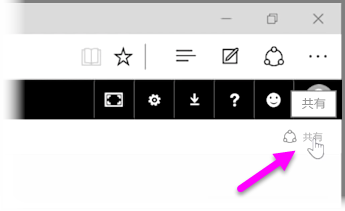

Power BI により、データを検索し、データ モデルにまとめ、そのデータを使用してレポートや視覚エフェクトを構築できることをこれまでに説明しました。 また、レポートを Power BI サービスに発行する方法や、時間の経過に伴う情報の変化を確認するのに役立つダッシュボードを作成する方法も説明しました。 これらの機能は、組織の他のユーザーと洞察を共有する、より強力な手段です。 ダッシュボードの共有は簡単です。

ダッシュボードを共有するには、Power BI サービスでダッシュボードを開き、右上隅の **[共有]** リンクを選びます。

**[ダッシュボードの共有]** ページが表示されたら、**[招待]** セクションを選び、**[Email address]** 入力ボックスに、ダッシュボードへのアクセス権を付与するユーザーのメール アドレスを入力します。 Power BI は、メール アドレスの入力中に組織のドメインや Office 365 ドメインのアカウントと照合を行い、可能な場合はオート コンプリートを表示します。 メール アドレスをコピーして入力ボックスに貼り付けることもできます。一度に複数の人を入力する場合は、配布リスト、セキュリティ グループ、Office 365 グループを使用することもできます。

下部にある *[電子メール通知を受信者に送信する]* チェックボックスを選ぶと、受信者はダッシュボードを共有したことを知らせるメール (ダッシュボードのリンクを含む) を受信します。 送られるメールには手動でメモを追加することも、Power BI で自動的に作成するメモ (メール アドレス入力欄の直下のボックス) を送信することもできます。

>[!NOTE]
>既存の Power BI アカウントがない受信者は、ダッシュボードを表示する前にサインアップの手順が必要になります。
> 
> 

ダッシュボードを共有するすべてのユーザーは、あなたとまったく同じ画面を見てやり取りを行うことができます。 ただし、共有ユーザーによる基になるレポートへのアクセスは*読み取り専用*で、基になるデータセットへの*アクセス権はありません*。

[ダッシュボードの共有] ページの **[共有先]** タブを選んで、既にこのダッシュボードを共有しているユーザーを表示することもできます。

