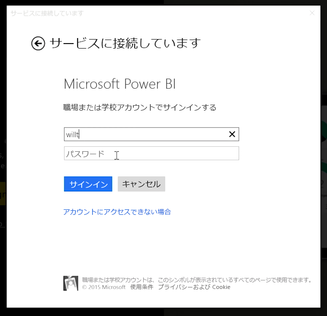
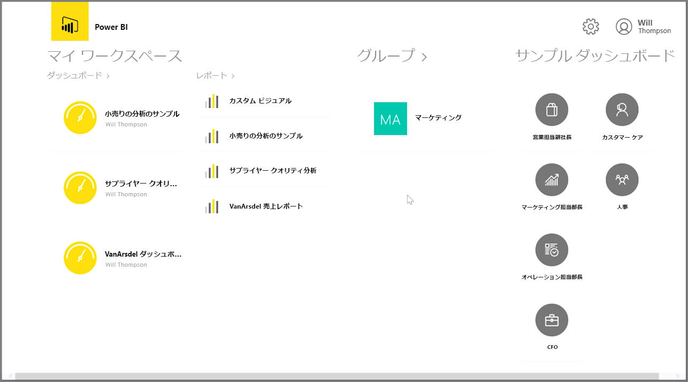
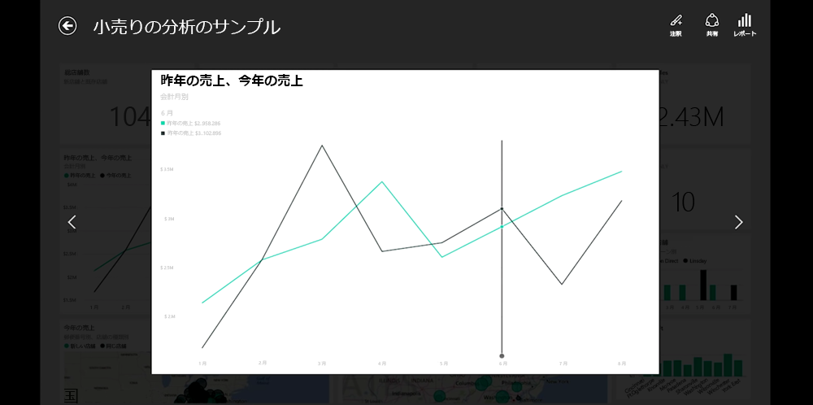
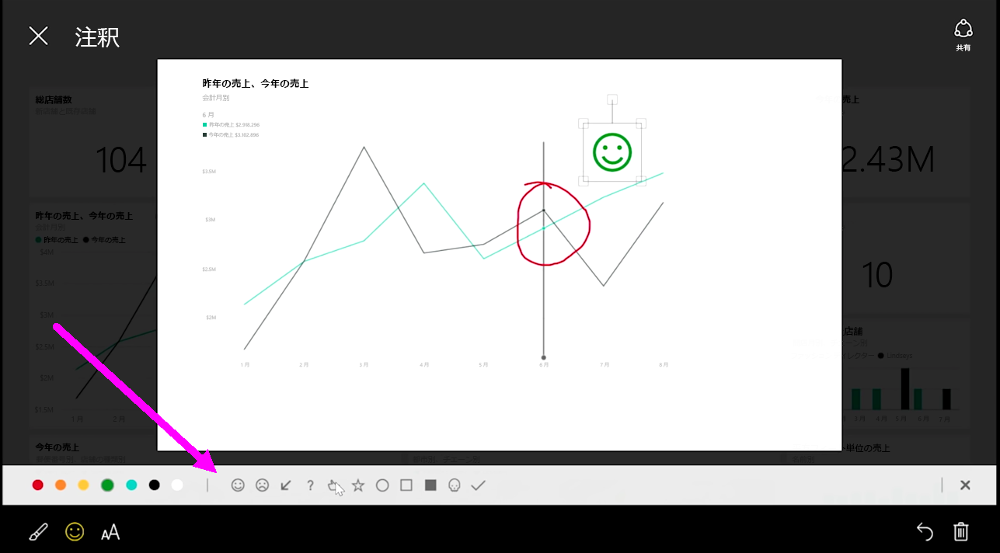

移動中にデータの追跡をする場合は、Power BI モバイル アプリをお使いください。iOS、Android、Windows の各デバイス用を用意しております。

Power BI アプリを使用する場合は、Power BI サービス アカウントの情報を使用してアカウントにサインインします。 Windows モバイル デバイス (この場合はタブレット) では、サインインは次のように行います。

表示される最初の画面では、レポート、ダッシュボード、グループを含むアクセス可能なすべてのコンテンツが表示されます。 Power BI の概要や、機能を確認するためのサンプルのダッシュボードもあります。 アプリはタッチ操作に合わせて設計されています。ダッシュボードやレポートをタップして、全画面表示にしたり、スクロール表示したりするなど、指で操作することができます。

どのダッシュボードもタップして開くことができます。 ダッシュボードでは、ダッシュボード タイルをタップして、拡大表示でフォーカスすることができます。

右上隅の **[Annotate]** ボタンをタップすると、検出された洞察にコメントを付けることもできます。 これにより、フォーカスしたタイル上で、特定の領域を強調表示することができます。 注釈ツールは画面下部に表示されます。

右上隅の **[共有]** リンクをタップすると、注釈付きのタイルを共有できます。

右上隅の **[Report]** リンクをタップすると、タイルの基になるレポートを表示できます。 Web ブラウザーでもPower BI Desktop でも、表示される視覚エフェクトはまったく同じで、バーをタップしたり、ドリルダウンしたり、スライサーを使用してレポートを操作することもできます。

