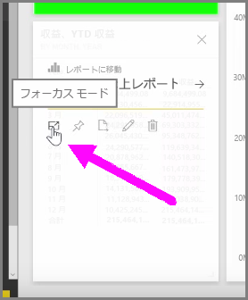
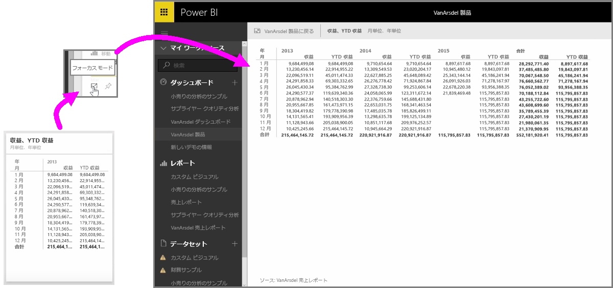

サービスの Power BI ダッシュボードまたはレポートを表示する場合、個々のグラフまたは視覚エフェクトに焦点を絞ると便利です。 これは、2 つの異なる方法で実現できます。

ダッシュボード上では、タイル上にポインターを合わせると、その右上隅にいくつかの異なるアイコン オプションが表示されます。 省略記号 (3 つのドット) を選択すると、タイル上で実行できる操作を表すアイコンのコレクションが表示されます。

左端には、**[フォーカス モード]** というラベルが付いたアイコンがあります。 このアイコンを選択すると、ダッシュボードの全領域を使用するようにタイルが拡張されます。

**フォーカス モード**を使用すると、ビジュアルと凡例の詳細を表示できます。 たとえば、Power BI のタイルのサイズを変更したときに、タイルで使用可能な領域の制限により、一部の列が表示されなくなる場合があります。

**フォーカス モード**では、すべてのデータを表示できます。 また、**[ピン留め]** アイコンを選択すると、ビジュアルをフォーカス モードから異なるダッシュボードに直接ピン留めすることができます。 **フォーカス モード**を終了するには、**フォーカス モード**の画面の右上隅の **[戻る]** アイコンを選択します。

同様の手順でレポートを表示することができます。 ビジュアルにポインターを合わせると、右上隅に 3 つのアイコンが表示されます。**[フォーカス モード]** アイコンを選択します。 このアイコンを選択すると、レポート キャンバス全体を使用するように視覚エフェクトが拡大されます。 視覚エフェクトの間のクロスフィルター効果は一時的に失われますが、ビジュアルはこのモードでも対話的に操作できます。

前のビューに戻るには、拡張されたタイルまたはレポートにポインターを合わせ、左上隅の **[戻る]** 左キャレット アイコンを選択します。

