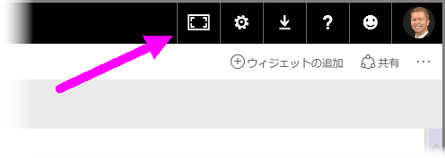
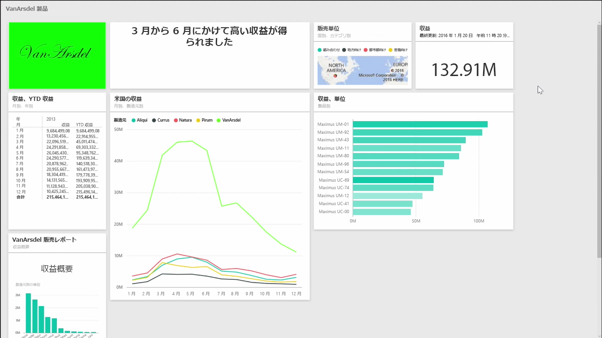
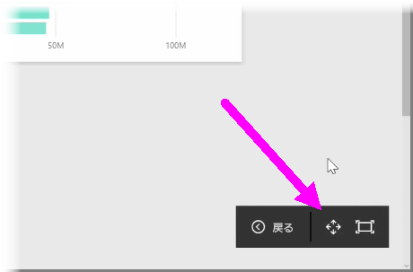
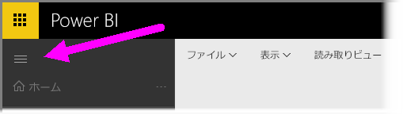

ダッシュボードを作成する際、コンテンツの内容によってはキャンバスに入りきらないことがあります。 ダッシュボード領域の表示状態を管理するため、ダッシュボードのコンテンツをすべて表示するのに役立つ方法がいくつかあります。

1 つの画面でダッシュボード全体を表示する最も簡単な方法は、ダッシュボードの右上隅にある **[全画面表示モード]** ボタンを選ぶことです。

**[全画面表示モード]** ボタンを選ぶと、ブラウザーが全画面表示になり、ダッシュボードからすべての chrome 要素が削除され、表示可能領域が拡大されます。

**[全画面表示モード]** で **[画面に合わせる]** オプションを選ぶと、すべてのタイルが縮小されて 1 つの画面に収まるため、スクロール バーが不要になります。 これは*テレビ モード*と呼ばれ、ダッシュボードを使用したプレゼンテーションや、大型モニターにダッシュボードを表示する際に便利です。

ダッシュボードのスペースを管理するもう 1 つの方法は、ハンバーガーアイコンを選んで、ページ左側のナビゲーション ウィンドウを折りたたむことです。 ナビゲーション ウィンドウを展開するには、アイコンをもう一度クリックします。

URL の末尾に次の内容を追加すると、ダッシュボードのナビゲーション バーを常に折りたたんだ状態にしておくことができます。

> ?collapseNavigation=true
> 
> 

そのリンクをフォローしているユーザーには、ナビゲーション バーが折りたたまれた状態でダッシュボードが開きます。

