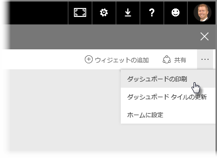
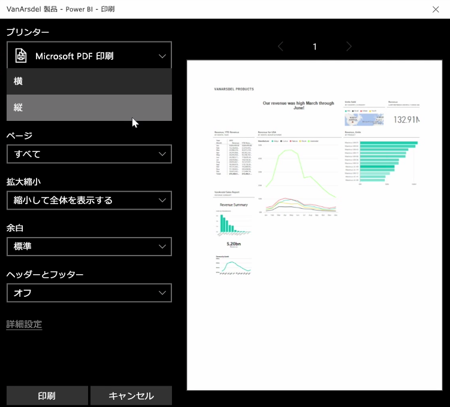
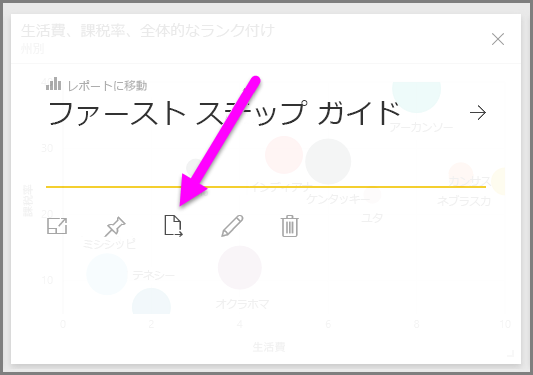
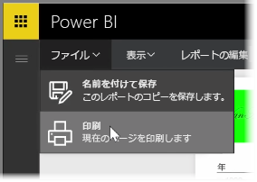

会議用にレポートやダッシュボードを印刷したり、他のユーザーと共有する場合があります。 Power BI では、いくつかの方法でビジュアルの印刷を行うことができます。

Power BI サービスで、サービスの右上にある省略記号 (...) を選び、 **[ダッシュボードを印刷]** を選びます。

**[印刷]** ダイアログが表示されたら、ダッシュボードを送信するプリンターの選択や、印刷の向きを *[縦]* または *[横]* にするなど、標準の印刷オプションを設定できます。

## ビジュアルからデータをエクスポートする
Power BI サービスでは、ビジュアルからデータをエクスポートすることもできます。 ビジュアルの省略記号 (...) を選び、 **[データをエクスポート]** ボタン (中央のボタン) を選びます。 これで CSV ファイルが作成され、ローカル コンピューターにダウンロードされます。ダウンロードが完了すると、通常のダウンロードと同じようにブラウザーにメッセージが表示されます。

レポートから直接印刷またはエクスポートすることもできます。 Power BI サービスでレポートを表示して、 **[ファイル] > [印刷]** を選び、印刷ダイアログ ボックスを開きます。

レポートのビジュアル上の [エクスポート] ボタンを選ぶと、ダッシュボードと同じように、ビジュアルからデータをエクスポートすることもできます。

