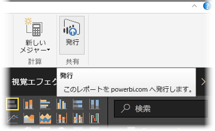

Power BI Desktop から Power BI サービスに発行済みのレポートやデータセットを更新できます。 これを行うには、リボンの **[ホーム]** タブから **[発行]** を選びます。

Power BI サービスの既存のレポートを発行する場合は、以前のデータセットとレポートを更新用に選択した編集バージョンに置き換えるかどうかの確認を求められます。

**[置き換える]** を選ぶと、Power BI サービスのデータセットとレポートは、Power BI Desktop の最新バージョンのファイルで上書きされます。

Power BI Desktop から行うその他の**発行**イベントと同様に、発行イベント成功のダイアログ ボックスが表示され、Power BI サービス内のレポートへのリンクが通知されます。

手動でデータを更新する手順は以上です。 自動でデータセットとレポートを更新することもできます。手順については、他の学習トピックで説明します。

