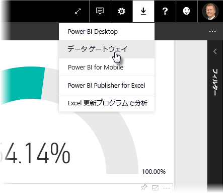
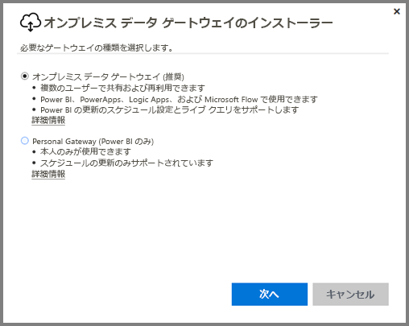
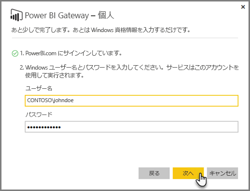
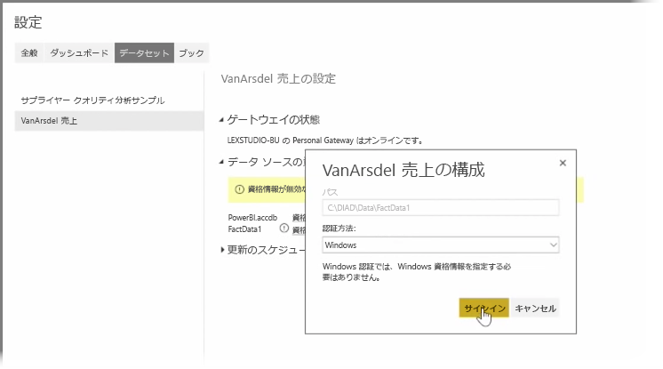
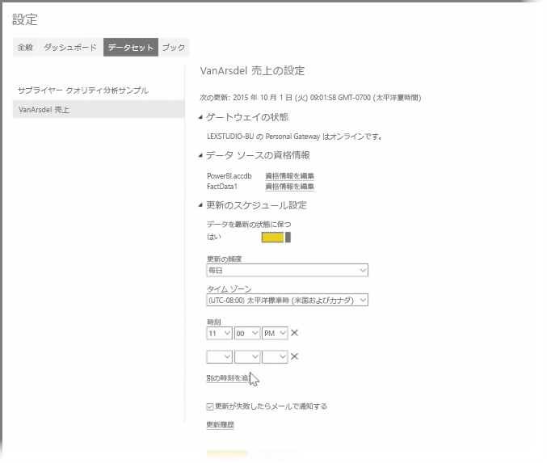

前のトピックでは、Power BI を使用してデータ ソースに接続する方法と、Power BI サービスのデータセットを手動で更新する方法を説明しました。 ただし、データの変更があるたびに手動で更新するのではなく、Power BI を使用してスケジュールされた更新を設定し、自動でデータ ソースに接続して、Power BI サービスに発行することもできます。 これによって、Excel ファイル、Access データベース、SQL データベースなど、任意のオンプレミスのデータ ソースとサービスを接続することができます。

オンプレミスのデータ ソースを Power BI サービスに接続できるシステムを、**データ ゲートウェイ**と呼びます。 これはコンピューター上で実行される小さなアプリケーションで、既定のスケジュールを使用してデータに接続し、更新情報をすべて収集し、Power BI サービスにプッシュします。 **Personal Gateway** は、管理者設定を行わなくても使用できる**データ ゲートウェイ**のバージョンです。

>[!NOTE]
>**Personal Gateway** が適切に機能するためには、Power BI Personal Gateway を実行するコンピューターがインターネットに接続されている*必要があります*。
> 

**Personal Gateway** を設定するには、まず Power BI サービスにログインします。 画面の右上隅の **[ダウンロード]** アイコンを選んで、メニューから **[データ ゲートウェイ]** を選びます。

そこから Web ページに移動するので、下の表示のように **[Power BI Gateway - Personal]** を選びます。

ダウンロードが完了したら、アプリケーションを実行し、インストール ウィザードを実行します。

ゲートウェイを設定する構成ウィザードを起動するように求められます。

ゲートウェイ サービスはアカウントに基づいて実行されるため、最初に Power BI のサービス アカウントにログインし、次にコンピューターの Windows アカウントにログインするように求められます。

Power BI サービスに戻ります。 更新対象のデータセットの横にある省略記号 (...) を選び、メニューから **[更新のスケジュール設定]** を選びます。 **[設定の更新]** ページが開きます。 Power BI は、**Personal Gateway** がインストールされていることを検出し、その状況を通知します。

適用可能な各データ ソースの横にある **[資格情報の編集]** を選び、認証設定を行います。

最後に、**[更新のスケジュール設定]** の下のオプションで自動更新をアクティブ化し、更新時刻と頻度を設定します。

これで完了です。 スケジュールされた時刻に、Power BI は提供された資格情報と **Personal Gateway** を実行中のコンピューターへの接続を使用してデータ ソースにアクセスし、スケジュールに従ってレポートとデータセットを更新します。 次回の Power BI へのアクセス時に、対象のダッシュボード、レポート、データセットは、スケジュールされた最新の更新を反映しています。

## 次の手順
**お疲れ様でした。** Power BI の**ガイド付き学習**コースの「**データの探索**」セクションが完了しました。 Power BI サービスには、データの探索、洞察の共有、ビジュアルによる対話などの興味深い方法が多数あります。 どこにいても、ブラウザーや接続サービスからのアクセスが可能です。

Power BI の、強力でよく知られているパートナーの 1 つは **Excel** です。 Power BI と Excel は、連携を考慮した設計になっており、Power BI 上でもブックを同じように、簡単に扱うことができます。

どれくらい簡単でしょうか。 それは次のセクション「**Power BI と Excel**」ではっきりとわかります。

次のセクションをご覧ください。

