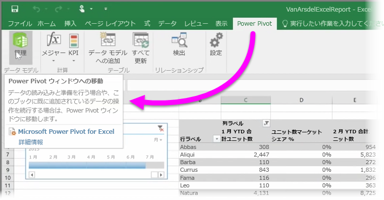

クエリを実行してデータを読み込む **Power Query** (Excel 2016 では **Get & Transform (データの取得と変換)** といいます)、強力なデータ モデルを作成する **Power Pivot**、動的なレポートを作成する **Power View** などの Excel の高度な BI 機能のいずれかを使用すると、それらを Power BI にインポートすることもできます。

**Power Pivot** を使用して、複数の関連するテーブル、メジャー、計算列、階層構造などを持つ高度なデータ モデルを作成すると、Power BI ではこれらすべてをインポートすることもできます。

ワークブックに **Power View シート**があれば問題ありません。 Power BI では、これらを Power BI の新しい**レポート**として再作成します。 直ちにダッシュボードへの視覚エフェクトのピン留めを開始できます。

Power BI の優れた機能の 1 つを次に示します。Power Query または Power Pivot を使用して、クエリ、および Power BI にブックをインポートしたら、外部データ ソースからデータの読み込みに接続する場合はセットアップできます**スケジュールされた更新**します。 スケジュールされた更新を使用すると、Power BI はワークブックからの接続情報を使用してデータ ソースとクエリに直接接続し、変更されたデータを読み込みます。 また、レポートの視覚エフェクトは自動的に更新されます。

