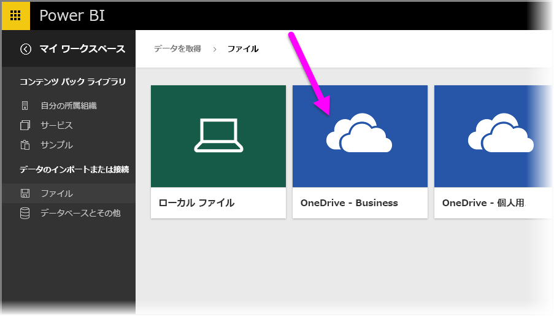
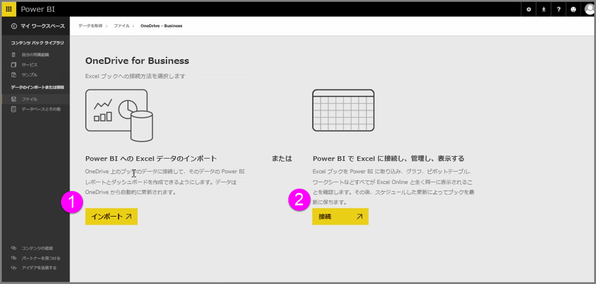
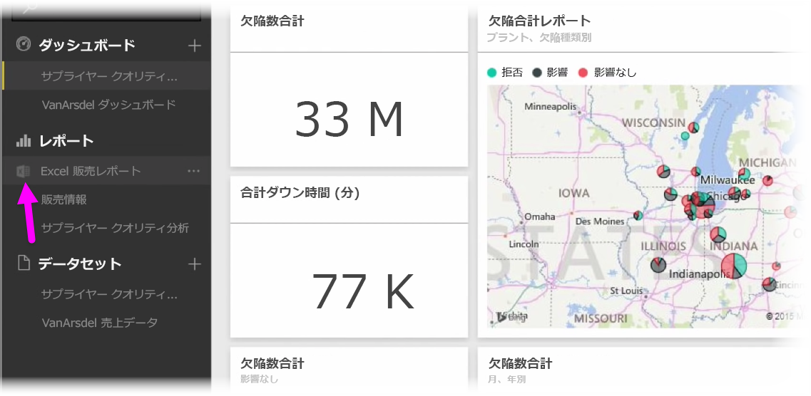
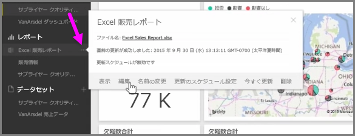

Excel ワークブックを OneDrive に保存する場合、Power BI と Excel をシームレスに統合できます。

Power BI と同様に、OneDrive はクラウドにあるため、Power BI と OneDrive のライブ接続が行われます。 OneDrive 上のワークブックを変更すると、これらの変更が Power BI に*自動的に同期*されます。 レポートとダッシュボードの視覚エフェクトは最新の状態に保たれます。 データベースや OData フィードなどの外部データ ソースにワークブックを接続している場合、Power BI の**更新のスケジュール設定**機能を使用して更新プログラムを確認できます。 ワークブック内のデータに関する質問を投稿する必要がありますか。 問題はありません。 Power BI の **Q & A** 機能を使用するだけで済みます。

OneDrive for Business の Excel ファイルに接続する方法は、次の 2 つです。

1. Power BI への Excel データのインポート
2. Power BI で Excel に接続し、管理し、表示する

### Power BI への Excel データのインポート
Excel データを Power BI にインポートすることを選択すると、ワークブックのテーブル データが Power BI の新しいデータセットに読み込まれます。 **Power View** シートがワークブックにある場合、それらがインポートされ、新しいレポートも自動的に Power BI で作成されます。

Power BI により、OneDrive for Business でこのシートとワークブック ファイルの接続が維持されます。 ワークブックを変更する場合、ワークブックを保存すると、通常 1 時間以内にそれらの変更が Power BI と*自動的に同期**されます。 ワークブックを外部データ ソースに接続している場合、Power BI のデータセットが最新の状態に保たれるように、更新のスケジュール設定を行うことができます。 Power BI のレポートと ダッシュボードの視覚エフェクトでは、データセットのデータを使用してデータを探索するため、クエリを瞬時に実行できます。

### Power BI での Excel の接続、管理、表示
Excel ワークブックへの接続を選択すると、Excel と Power BI でワークブックのシームレスな操作を体感できます。 この方法で接続すると、ワークブックのレポートの横に小さな Excel のアイコンが表示されます。

レポートには、**Excel Online** の場合と同様、Excel ワークブックが Power BI に表示されます。 Excel Online でワークシートを探索、編集するには、省略記号のメニューから [編集] を選択します。 変更を加えると、ダッシュボードにピン留めした視覚エフェクトが自動的に更新されます。

Power BI にデータセットは作成されません。 すべてのデータは OneDrive 上のワークブックに残ります。 この方法のさまざまな利点の 1 つは、ワークブックを外部データ ソースに接続した場合に、**更新のスケジュール設定**を実行できる点です。 ピボット テーブルやチャートなどの要素を選択して、Power BI のダッシュボードにその場で**ピン留め**できます。 変更を加えると、それらが Power BI で自動的に反映されます。 また、Power BI の優れた **Q & A** 機能を使用して、ワークブック内のデータに関する質問を投稿できます。  

