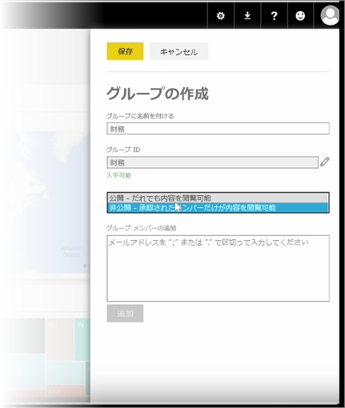
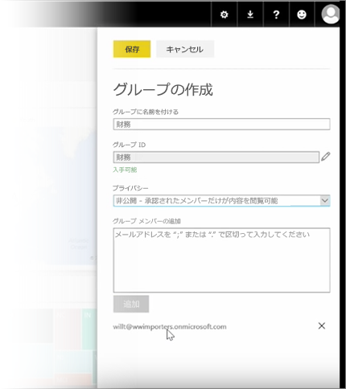

このレッスンでは、まず*グループ*を作成します。 **グループ**は、特定のダッシュボード、レポート、データへのアクセス権を持つユーザーのセットを定義します。

Power BI のグループは Office 365 のグループに基づくため、グループの電子メール、予定表、ドキュメントの管理に Office 365 グループを使用している場合は Power BI から同じ機能やその他の機能が提示されていることが分かります。 Power BI でグループを作成する場合、実質的に Office 365 グループを作成しています。

このモジュールでは、新しい経理グループの設定のシナリオを使用します。 ここでは、グループ、共有ダッシュボード、レポート、データセットをグループに設定し、グループ内でこれらのアイテムへのアクセス権を持つメンバーを追加する方法を紹介します。

個人用ワークスペースで開始します。 これらは、自分で作成したか、他のユーザーと共同で作成した、ダッシュボード、レポート、データセットです。

個人用ワークスペースを展開した場合、**[グループの作成]** を選択できます。

ここに名前を指定します。 ここでは経理グループのシナリオを使用しているので、Finance という名前を付けます。 Power BI がドメインにこの名前が存在しないことを確認します。

組織内のユーザーがグループのコンテンツを表示できるのか、グループのメンバーのみを表示できるのかを決定することで、プライバシー レベルを設定できます。

電子メール アドレス、セキュリティ グループ、配信リストをここに入力します。 **[追加]** を選択し、これらをグループのメンバーにして、グループを保存します。

次のレッスンに進みましょう。

