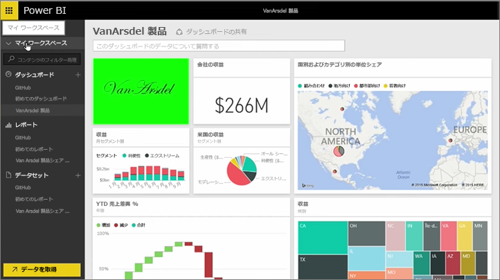
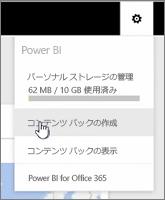
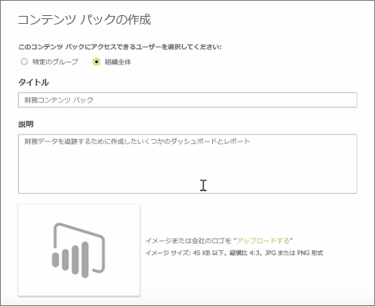
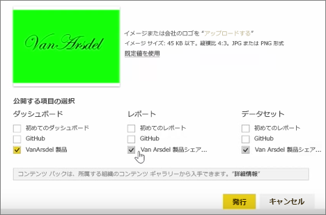
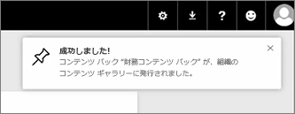

このレッスンでは、Power BI の既存の成果物で*コンテンツ パック*を作成し、同僚と共有します。

**[マイ ワークスペース]** にはダッシュボードがあり、その下にレポートとデータセットがあります。 これをパッケージ化して組織の同僚と共有し、再利用できるようにしたいと考えています。

**[設定]** アイコン (サービス右上の歯車アイコン) を選ぶと、ストレージの使用量が表示され、コンテンツ パックを作成できます。

ダイアログ ボックスが表示されるので、特定のユーザーまたはグループに配布するか、タイトルを付けるかどうかを選びます。 また、コンテンツ パックを見るユーザーに内容や機能がわかるよう、**[説明]** ボックスに詳細な説明を入力することをお勧めします。

ダイアログ ボックスの下部では、コンテンツ パックを示す画像をアップロードすることもできます。また、最も重要な手順として、コンテンツ パックに含めるダッシュボードを選びます。これにより、Power BI はダッシュボードで使用するレポートとデータセットを自動的に選択します。 このレポートやデータセットは、コンテンツ パックに含めるダッシュボードに必要なため、選択を解除することはできません。

その他のダッシュボード、レポート、データセットを選ぶこともできますが、今回は行いません。

発行すると、コンテンツ パックが組織のコンテンツ ギャラリーに追加されます。

次のレッスンに進みましょう。

