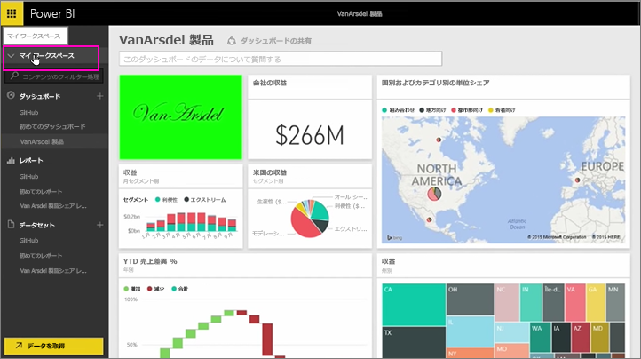
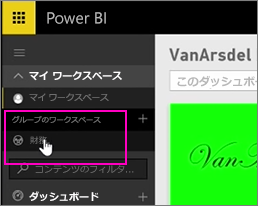
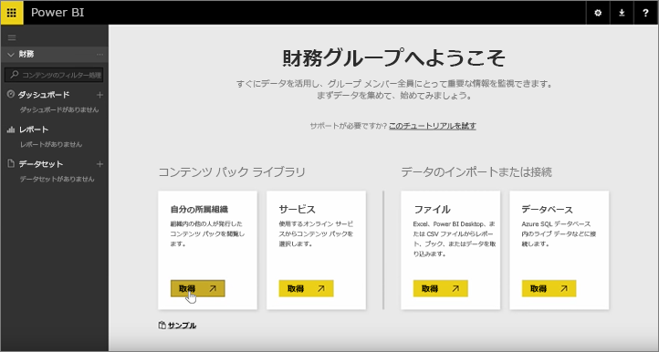
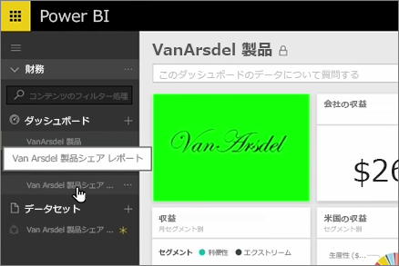
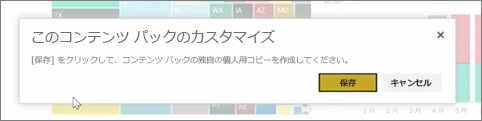
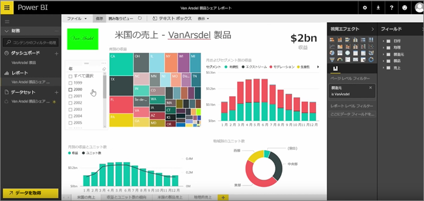

前のレッスンでは、コンテンツ パックとグループをすでに作成しました。 このレッスンでは、グループ全員用のコンテンツ パックのインスタンスを作成します。

個人用ワークスペースから開始します。

以前のレッスンで作成した経理グループに戻ります。

このグループにはまだダッシュボード、レポート、データセットが一切ありません。 自分で作成したコンテンツ パックを使用します。 サード パーティのサービスのコンテンツ パックではなく、自分の所属組織のコンテンツ パックを閲覧します。

先ほど作成したコンテンツ パックが見つかります。 見つけてもらいやすい適切なタイトル、説明、イメージを付けることの重要性がわかります。 見つけたコンテンツ パックに接続します。

コンテンツ パックに含まれているダッシュボード、レポート、データセットが Power BI によってインポートされます。

データセットを選ぶと、コンテンツ パックをカスタマイズするかどうか尋ねられます。

変更を加えることができるようコンテンツ パックのコピーを作成し、それをコンテンツ パックの公開バージョンから切り離します。 コンテンツ パックの作成者が公開バージョンに変更を加えても、更新が自動的に取り込まれることはありません。

しかし、必要なら、ダッシュボード、レポート、さらにはデータセットさえ、編集できます。

このように、コンテンツ パックは、組織内の他の人が作成したコンテンツを再利用するための簡単な方法となります。

次のレッスンは、[Power BI でコンテンツ パックを作成する](6-4-update-content-pack.md)です。

