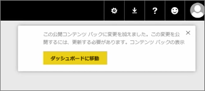
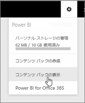
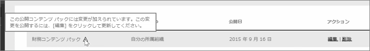

このレッスンでは、前に作成したオリジナルのコンテンツ パックを編集し、接続した他のユーザーを更新する方法について確認します。

個人用のワークスペースに戻り、オリジナルのダッシュボードを編集します。

ダッシュボードを変更するたびに、コンテンツ パックで他のユーザーと共有した内容を変更したことを示すこのような通知を受け取り、共有バージョンを更新するように要求されます。

設定のアイコンに戻って **[コンテンツ パックの表示]** を選択し、既に発行したコンテンツ パックを確認します。

作成したコンテンツ パックを確認します。 この小さなアイコンにより、コンテンツ パックの内容を変更したことが分かります。また、他のユーザーが変更を確認できるように、コンテンツ パックを編集する必要があります。

**[編集]** を選択すると、タイトルと説明を編集できる画面に戻りますが、この時点で **[更新]** ボタンが表示されているので、このボタンを選択します。

Power BI がこれらの変更を適用し、更新されたコンテンツ パックをコンテンツ パック ギャラリーに公開します。

マイ コンテンツ パックに接続しているユーザーは、コンテンツ パックが変更されたことを示し、その変更を受け入れるか、以前のバージョンを保持するかを確認するメッセージを受け取ります。

そのため、コンテンツ パックの所有者として、同僚が使用しているバージョンを管理できます。

