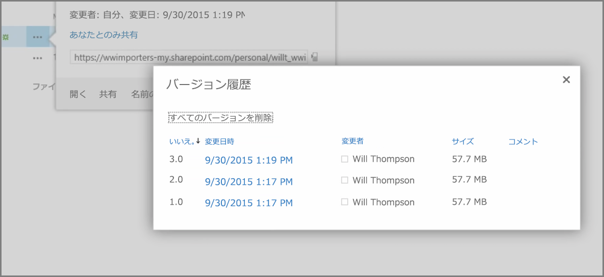
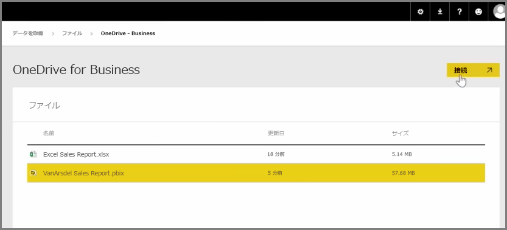

以前の記事では、Power BI 内のコンテンツで組織が管理とコラボレーションを行うのに役立つ、グループの作成について確認しました。 また、**OneDrive for Business** を使用することで、コラボレーションと共有のための Power BI と Office365 グループを使用することもできます。

Power BI コンテンツのソースとして OneDrive for Business を使用することで、バージョン履歴などの多数の便利なツールにアクセスできます。 また、OneDrive for Business 内から Office365 グループとファイルを共有してアクセス権を与えることで、多くのユーザーが同じ Power BI または Excel ファイルを操作することもできます。

OneDrive for Business で PBIX (Power BI Desktop) ファイルに接続するには、Power BI サービスにログインして **Get Data (データの取得)** を選択します。 [データのインポートまたは接続] で **[ファイル]** を選択してから、**[OneDrive - Business]** を選択します。 目的のファイルを強調表示して **[接続]** を選択します。

左側にあるナビゲーション バーにコンテンツが表示されます。

これで、**OneDrive for Business** でファイルに加えられた変更が自動的に Power BI 環境にも反映され、バージョン履歴に記録されます。

