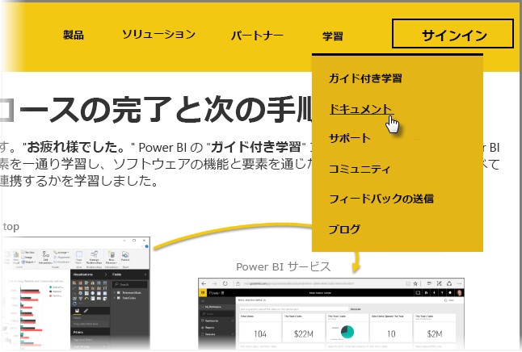

これで完成です。 **お疲れ様でした。** Power BI の**ガイド付き学習**コースが完了しました。 Power BI の基本的な要素を一通り学習し、ソフトウェアの機能と要素を通じたツアーを実行し、これらすべてがどのように連携するかを学習しました。

これはコースの最後のセクション (また、DAX を学習しない場合は、最後のトピック) ですので、これらのセクションのすべてを一巡していれば無事完了です。 お疲れ様でした。 これで次の**重要な概念**のすべてに精通しているはずです。

* [Power BI](../gettingstarted.yml?tutorial-step=1) の内容
* Power BI の[構成要素](../gettingstarted.yml?tutorial-step=3)
* データの[取得](../gettingdata.yml?tutorial-step=3)と[モデリング](../modeling.yml?tutorial-step=1)
* [視覚エフェクト](../visualizations.yml?tutorial-step=1)
* Power BI サービスでの[データの探索](../exploringdata.yml?tutorial-step=1)
* [Excel と Power BI](../powerbiandexcel.yml?tutorial-step=1) の併用
* 作業の[発行と共有](../publishingandsharing.yml?tutorial-step=1)

これらの大量の知識がすべて頭に入ったので、あとは実践に備えるだけです。 こちらの**ダウンロード リンク**を使用するか、またはお使いのブラウザーから **Power BI サービスに接続**してください。

* いつでも[最新の Power BI Desktop を入手](https://powerbi.microsoft.com/desktop)できます。
* [Power BI サービス](https://powerbi.microsoft.com/)への接続は簡単です。
* タップするだけで [Power BI 用のモバイル アプリ](https://powerbi.microsoft.com/mobile/)を取得できます。

さらに多くの**ヘルプと参照**コンテンツを利用できます。 このページの上部に移動して **[学習] > [ドキュメント]** を選択するだけで、多種多様な Power BI の参照コンテンツを表示できます。

この **Power BI のガイド付き学習**の体験を通じて、楽しく学習できたことでしょう。 皆様の成功と、Power BI のビジュアルが魅力と説得力を維持していけることを願っております。

## DAX ユーザー向けのもう 1 つのセクション
さらに詳細な情報が必要ですか? **DAX (Data Analysis Expressions)** を使用して Power BI でカスタムの列およびテーブルを作成、フィルター処理、または使用することに関心がありますか? もう 1 つ、Power BI で何らかのコード処理を希望するユーザーを対象にしたセクションを用意しています。このセクションのタイトルは、「**DAX の概要**」です。 関心がある方はご覧ください。「ガイド付き学習」の残りの部分と同じくわかりやすいアプローチを使用しています。

