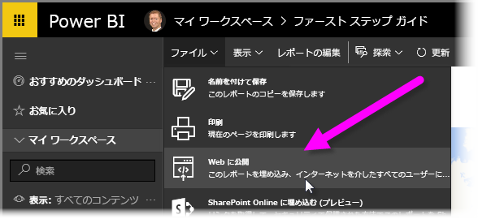
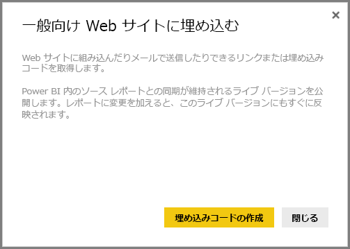
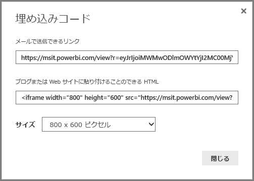
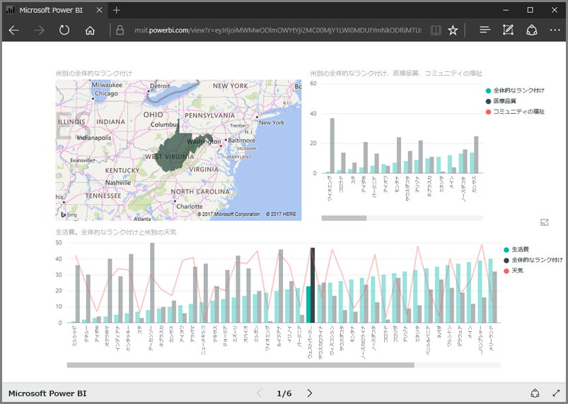
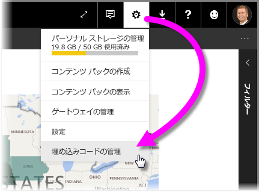

このレッスンでは、いくつかの簡単な手順で、Power BI レポートを Web ページ上で共有したり、電子メールで共有する方法について説明します。 この Power BI の機能は、多くの場合、**Web に公開**と呼ばれ、使いやすく、管理も簡単です。

Power BI で、キャンバスに表示されるように、共有するレポートを選択します。 次に、メニューから **[ファイル]、[Web に公開]** の順に選択します。

そうすると、Web サイトまたはメールにレポートを含めることができる *埋め込みコード* の取得について説明するダイアログが表示されます。

**[埋め込みコードの作成]** を選択すると、Power BI で別のダイアログが表示され、再度、インターネット上ですべてのユーザーとデータを共有しようとしていることが示されます。 それで問題ないことを確認します。

Power BI で次の 2 つのリンクを含むダイアログが表示されます。

* メールで共有できるリンク: Web ページとしてレポートが表示されます。
* HTML コード (リンク、および iframe 内): Web ページに直接レポートを埋め込むことができます。

HTML リンクの場合、埋め込みレポートの定義済みサイズから選択できます。また、自分で iframe コードを変更し、サイズをそのカスタマイズすることもできます。

電子メール リンクをブラウザーに貼り付けるだけで、レポートを Web として表示できます。 Power BI でレポートを表示する場合と同じように、その Web ページと対話できます。 次の図には、ダイアログから直接ブラウザーにリンクをコピーした場合の **[Web に公開]** ページが示されています。

iframe リンクは、ブログの投稿、Web サイト、Sway にも埋め込むことができます。

作成した埋め込みコードを削除する場合も 問題はありません。 Power BI で、右上隅にある **歯車** アイコンを選択してから、 **[埋め込みコードの管理]** を選択します。

Power BI のワークスペースに、作成した埋め込みコード (以下の図では 1 つだけ) が表示されます。 省略記号をクリックして、埋め込みコードのコードを取得するか、埋め込みコードを完全に削除するかを選ぶことができます。

以上の方法で Power BI レポートを Web に公開し、世界中で共有します。 これは簡単にできます。

