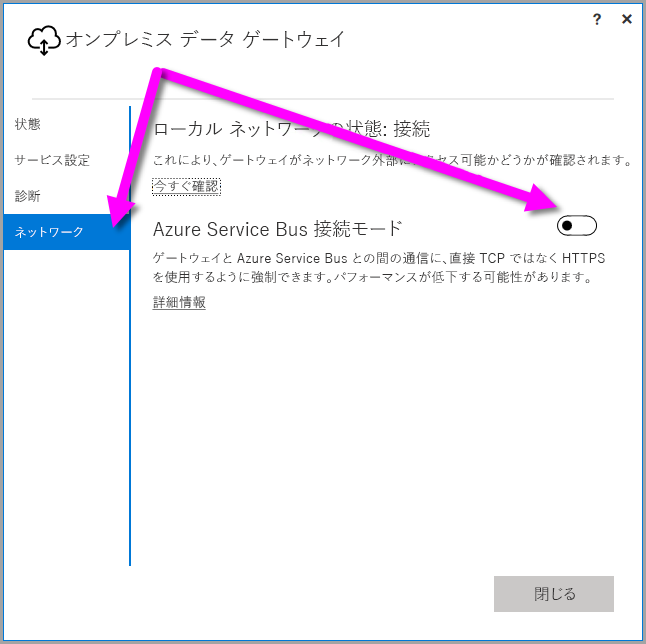

## <a name="sign-in-account"></a>サインイン アカウント
ユーザーは職場または学校のアカウントでサインインします。 これは組織アカウントです。 Office 365 サービスにサインアップし、実際の職場のメールを指定しなかった場合、nancy@contoso.onmicrosoft.com のようになります。クラウド サービス内では、アカウントは Azure Active Directory (AAD) のテナント内に保存されます。 ほとんどの場合、AAD アカウントの UPN はメール アドレスに一致します。

## <a name="windows-service-account"></a>Windows サービス アカウント
オンプレミス データ ゲートウェイは、Windows サービスのログオン資格情報に *NT SERVICE\PBIEgwService* を使用するように設定されています。 既定では、この資格情報には、サービスとしてログオンの権限があります。 これは、ゲートウェイのインストール先コンピューターのコンテキストです。

> [!NOTE]
> 個人モードを選択した場合は、Windows サービス アカウントを個別に構成します。
> 
> 

これは、オンプレミスのデータ ソースへの接続に使用するアカウントではありません。  また、クラウド サービスへのサインインに使用する職場または学校のアカウントでもありません。

認証のためにプロキシ サーバーで問題が発生する場合は、Windows サービス アカウントをドメイン ユーザーまたは管理されたサービス アカウントに変更する必要があります。 [プロキシ構成](../service-gateway-proxy.md#changing-the-gateway-service-account-to-a-domain-user)でアカウントを変更する方法についてはこちらをご覧ください。

## <a name="ports"></a>ポート
ゲートウェイは、Azure Service Bus への送信接続を作成します。 通信は、送信ポート TCP 443 (既定値)、5671、5672、9350 ～ 9354 で行われます。  ゲートウェイには、受信ポートは必要ありません。 [詳細情報](https://azure.microsoft.com/documentation/articles/service-bus-fundamentals-hybrid-solutions/)

ファイアウォールでデータ領域の IP アドレスをホワイトリストに登録することをお勧めします。 [Microsoft Azure データ センター IP リスト](https://www.microsoft.com/download/details.aspx?id=41653)をダウンロードできます。 このリストは毎週更新されます。 ゲートウェイは、IP アドレスと完全修飾ドメイン名 (FQDN) を使って Azure Service Bus と通信します。 HTTPS を使用して通信するようにゲートウェイを強制している場合は、必ず FQDN のみを使用し、IP アドレスを使用した通信は行われません。

> [!NOTE]
> Azure データ センター IP リストに列記されている IP アドレスは CIDR 表記です。 たとえば、10.0.0.0/24 は 10.0.0.0 ～ 10.0.0.24 の意味ではありません。 [CIDR 表記](http://whatismyipaddress.com/cidr)についてはこちらをご覧ください。
> 
> 

ゲートウェイで使用される完全修飾ドメイン名の一覧を次に示します。

| ドメイン名 | 送信ポート | 説明 |
| --- | --- | --- |
| *.download.microsoft.com |80 |インストーラーをダウンロードするために使用する HTTP です。 |
| *.powerbi.com |443 |HTTPS |
| *.analysis.windows.net |443 |HTTPS |
| *.login.windows.net |443 |HTTPS |
| *.servicebus.windows.net |5671-5672 |Advanced Message Queuing Protocol (AMQP) |
| *.servicebus.windows.net |443, 9350-9354 |TCP 上での Service Bus Relay のリスナー (Access Control のトークン取得のために 443 が必要) |
| *. frontend.clouddatahub.net |443 |HTTPS |
| *.core.windows.net |443 |HTTPS |
| login.microsoftonline.com |443 |HTTPS |
| *.msftncsi.com |443 |Power BI サービスがゲートウェイに到達できない場合に、インターネット接続をテストするために使用します。 |
| *.microsoftonline-p.com |443 |構成によっては認証に使用します。 |

> [!NOTE]
> visualstudio.com または visualstudioonline.com へのトラフィックはアプリの洞察用であり、関数へのゲートウェイには必要ありません。
> 
> 

## <a name="forcing-https-communication-with-azure-service-bus"></a>Azure Service Bus との強制的な HTTPS 通信
ゲートウェイと Azure Service Bus との間の通信に、直接 TCP ではなく HTTPS を使用するように強制できます。 これはパフォーマンスに影響する場合があります。 この操作を行うには、この段落の直後に続くコード スニペットに示すように、値を `AutoDetect` から `Https` に変更して、*Microsoft.PowerBI.DataMovement.Pipeline.GatewayCore.dll.config* ファイルを変更します。 このファイルは、既定では *C:\Program Files\On-premises data gateway* にあります。

```
<setting name="ServiceBusSystemConnectivityModeString" serializeAs="String">
    <value>Https</value>
</setting>
```

*ServiceBusSystemConnectivityModeString* パラメーターの値は大文字小文字を区別します。 有効な値は、*AutoDetect* と *Https* です。

代わりに、[2017 年 3 月](https://powerbi.microsoft.com/blog/power-bi-gateways-march-update/)のリリースから開始する、ゲートウェイのユーザー インターフェイスを使用して、ゲートウェイがこの動作を適用するように強制することができます。 ゲートウェイのユーザー インターフェイスで、**[ネットワーク]** を選択し、**[Azure Service Bus 接続モード]** を **[オン]** に切り替えます。



変更した後、**[適用]** を選ぶと (変更を行ったときにのみ表示されるボタン)、*ゲートウェイ Windows サービス*が自動的に再起動して、変更が有効になります。

将来の参照のためには、**[サービス設定]**、*[今すぐ再起動]* の順に選ぶことで、ユーザー インターフェイスのダイアログから*ゲートウェイ Windows サービス*を再起動できます。


## <a name="support-for-tls-1112"></a>TLS 1.1/1.2 のサポート
2017 年 8 月の更新以降、オンプレミス データ ゲートウェイは既定でトランスポート層セキュリティ (TLS) 1.1 または 1.2 を利用して **Power BI サービス**と通信します。 オンプレミス データ ゲートウェイの以前のバージョンは、既定で、TLS 1.0 を使用します。 2018 年 3 月 15 日に TLS 1.0 のサポートが終了します。これには、ゲートウェイで TLS 1.0 を利用し **Power BI サービス**とやりとりする機能も含まれます。そのため、オンプレミス データ ゲートウェイを引き続き利用するには、そのときまでに 2017 年 8 月公開以降のものにアップグレードする必要があります。

11 月 1 日まではオンプレミス データ ゲートウェイは TLS 1.0 に対応しており、フォールバック メカニズムとしてゲートウェイに利用されることにご留意ください。 すべてのゲートウェイ トラフィックで TLS 1.1 または 1.2 が使用されるように (また、ゲートウェイで TLS 1.0 の使用を防止するために)、ゲートウェイ サービスを実行しているコンピューターで次のレジストリ キーを追加または変更する必要があります。

        [HKEY_LOCAL_MACHINE\SOFTWARE\Microsoft\.NETFramework\v4.0.30319]"SchUseStrongCrypto"=dword:00000001
        [HKEY_LOCAL_MACHINE\SOFTWARE\Wow6432Node\Microsoft\.NETFramework\v4.0.30319]"SchUseStrongCrypto"=dword:00000001

> [!NOTE]
> これらのレジストリ キーを追加したり、変更したりすると、すべての .NET アプリケーションに変更が適用されます。 他のアプリケーションの TLS に影響を与えるレジストリ変更については、[トランスポート層セキュリティ (TLS) レジストリ設定](https://docs.microsoft.com/windows-server/security/tls/tls-registry-settings)をご覧ください。
> 
> 

## <a name="how-to-restart-the-gateway"></a>ゲートウェイを再起動する方法
ゲートウェイは、Windows サービスとして実行されます。 他の Windows サービスのように、開始および停止できます。 これを行う方法は複数あります。 コマンド プロンプトを使用する方法を次に示します。

1. ゲートウェイが実行されているコンピューターで、管理者のコマンド プロンプトを起動します。
2. サービスを停止するには、次のコマンドを使用します。
   
   net stop PBIEgwService
3. サービスを開始するには、次のコマンドを使用します。
   
   net start PBIEgwService

