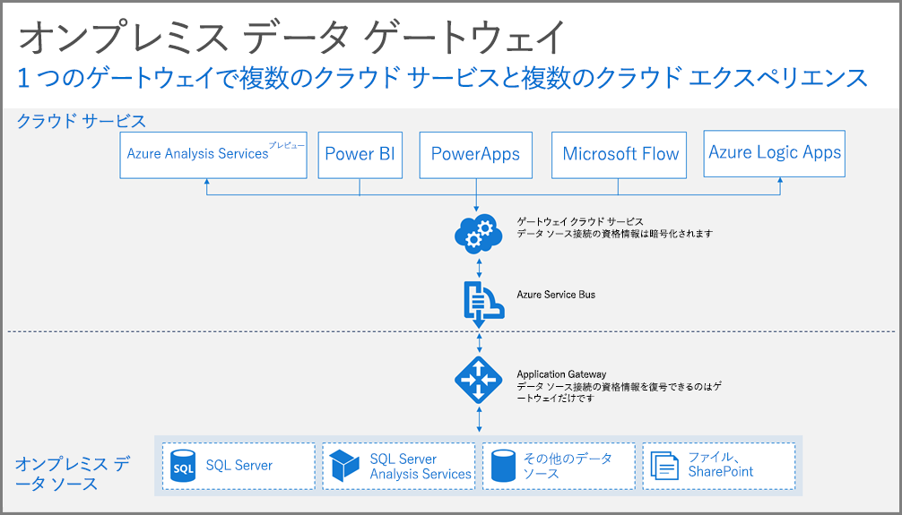

## ゲートウェイのしくみ

最初に、オンプレミスのデータ ソースに接続されたレポートを操作した場合に、どのような処理が行われるかを見てみましょう。 

> [!NOTE]
> Power BI の場合、ゲートウェイのデータ ソースを構成する必要があります。
> 
> 

1. クエリは、オンプレミスのデータ ソースの暗号化された資格情報を使用してクラウド サービスによって作成され、キューに送信されて、ゲートウェイで処理されます。
2. ゲートウェイ クラウド サービスは、クエリを分析し、要求を [Azure Service Bus](https://azure.microsoft.com/documentation/services/service-bus/) へプッシュします。
3. オンプレミス データ ゲートウェイは、[Azure Service Bus](https://azure.microsoft.com/documentation/services/service-bus/) へのポーリングを実行して保留中の要求の有無を確認します。
4. ゲートウェイはクエリを取得して資格情報の暗号化を解除し、その資格情報を使用してデータ ソースに接続します。
5. クエリは、ゲートウェイによってデータ ソースへ送信され、実行されます。
6. データ ソースからゲートウェイに結果が返送され、さらにクラウド サービスに送信されます。 結果がサービスで使用されます。

