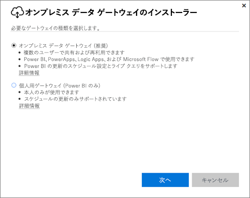
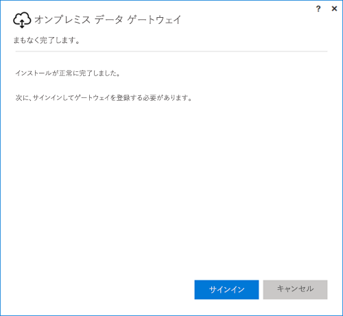
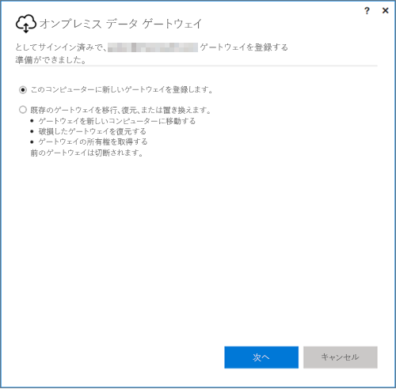
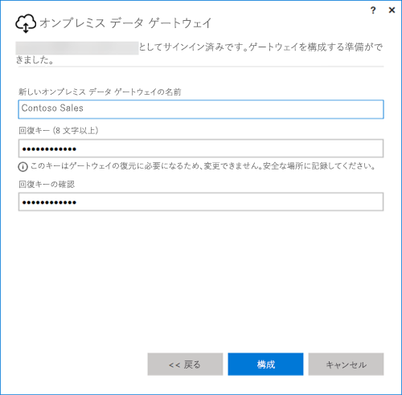

## オンプレミス データ ゲートウェのインストール
データ ゲートウェイがコンピューターにインストールされ、実行されます。 ゲートウェイは、常時稼働可能なコンピューターにインストールすることをお勧めします。

> [!NOTE]
> ゲートウェイは、64 ビット Windows オペレーティング システムでのみサポートされます。
> 
> 

Power BI の場合、最初に選ぶ必要があるのは、ゲートウェイのモードです。

* **オンプレミス データ ゲートウェイ:** このモードでは、複数のユーザーがゲートウェイを共有して再利用できます。 このゲートウェイは、Power BI、PowerApps、Flow、または Logic Apps で使用できます。 Power BI の場合、スケジュール更新と DirectQuery の両方のサポートが含まれます。
* **Personal:** これは Power BI 専用であり、管理者の構成を行わなくても、個人として使用できます。 これは、オンデマンドの更新とスケジュールの更新のためだけに使用できます。 これを選択すると、個人用ゲートウェイのインストールが開始します。

いずれのモードのゲートウェイをインストールする場合でも、いくつかの注意点があります。

* いずれのゲートウェイも 64 ビットの Windows オペレーティング システムを必要とします
* ドメイン コントローラーにゲートウェイをインストールすることはできません
* 最大 2 つのオンプレミス データ ゲートウェイを同じコンピューターにインストールできます。各モード (個人用と標準) に 1 つ実行します。 
* 同じコンピューターの同じモードで複数のゲートウェイを実行することはできません。
* 異なるコンピューターに複数のオンプレミス データ ゲートウェイをインストールし、すべて同じ Power BI ゲートウェイ管理インターフェイスから管理することができます。個人用は除きます。次の箇条書きをご覧ください。
* Power BI ユーザーごとに 1 つの個人用モード ゲートウェイを実行できます。 同じユーザーに別の個人用モード ゲートウェイをインストールする場合、コンピューターが違っていても、一番新しいインストールが前のインストールに取って代わります。

ゲートウェイをインストールする前に考慮する点を次に示します。

* ノート PC にインストールすると、ノート PC の電源がオフでインターネットに接続していないときや、ノート PC がスリープ状態のとき、ゲートウェイは動作せず、クラウド サービスにあるデータはオンプレミスのデータと同期されません。
* コンピューターがワイヤレス ネットワークに接続されている場合、ゲートウェイの動作は遅くなる可能性があり、そのため、クラウド サービス内のデータとオンプレミスのデータを同期するのに時間がかかることがあります。

ゲートウェイがインストールされたら、職場または学校のアカウントでサインインする必要があります。

サインインした後、新しいゲートウェイを構成するか、既存のゲートウェイを移行、復元、または継承するかを選択できます。

## 新しいゲートウェイの構成
1. ゲートウェイの**名前**を入力します。
2. **回復キー**を入力します。 これは 8 文字以上である必要があります。
3. **[構成]** を選択します。

> [!NOTE]
> 回復キーは、ゲートウェイを移行、復元、継承する場合に必要になります。 このキーは安全な場所に保存してください。
> 
> 

### 既存のゲートウェイの移行、復元、または継承
回復するゲートウェイを選択し、最初にゲートウェイを作成するときに使用した回復キーを指定する必要があります。

### 接続されたオンプレミス データ ゲートウェイ
ゲートウェイを構成した後、ゲートウェイを使用してオンプレミス データ ソースに接続できます。

ゲートウェイが Power BI 用の場合は、Power BI サービス内のゲートウェイにデータ ソースを追加する必要があります。 これは、**[ゲートウェイの管理]** 領域で行います。 詳細については、データ ソースの管理に関する記事をご覧ください。

PowerApps の場合は、サポートされているデータ ソースの定義済み接続用のゲートウェイを選択する必要があります。 Flow と Logic Apps の場合は、このゲートウェイをオンプレミス接続に使用できます。

