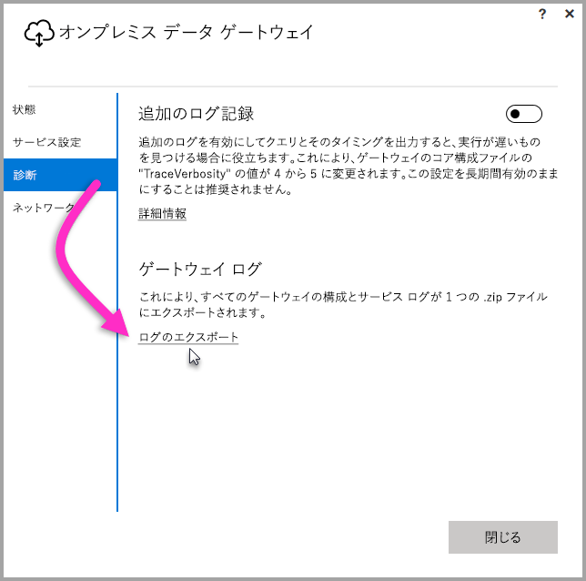
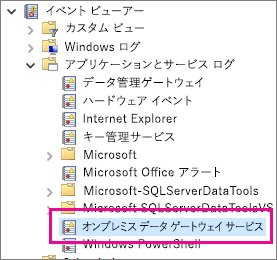

## トラブルシューティングするためのツール
<a name="logs" />

### ゲートウェイ構成ウィザードからのログ収集
ゲートウェイに関していくつかのログを収集できます。常にログを確認することから始めてください。 ゲートウェイのインストール後にログを収集する最も簡単な方法は、ユーザー インターフェイスを利用することです。 **オンプレミス データ ゲートウェイ** ユーザー インターフェイスで、**[診断]** を選択し、ページの下部付近にある **[ログのエクスポート]** リンクを選択します。次の画像をご覧ください。

**インストーラーのログ**

    %localappdata%\Temp\On-premises_data_gateway_*.log

**構成のログ**

    %localappdata%\Microsoft\on-premises data gateway\GatewayConfigurator*.log

**オンプレミス データ ゲートウェイ サービスのログ**

    C:\Users\PBIEgwService\AppData\Local\Microsoft\on-premises data gateway\Gateway*.log

### イベント ログ
**オンプレミス データ ゲートウェイ サービス**のイベント ログは、**アプリケーションとサービス ログ**の下にあります。

<a name="fiddler" />

### Fiddler のトレース
[Fiddler](http://www.telerik.com/fiddler) は、HTTP トラフィックを監視する Telerik 提供の無償ツールです。  クライアント コンピューターから Power BI サービスによるやり取りを確認できます。 これにより、エラーとその他の関連する情報が表示される場合があります。

