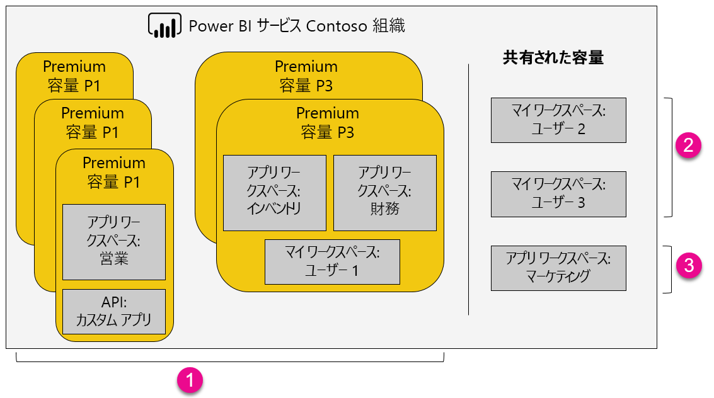

1. Premium 容量内の項目
   
   * アプリ ワークスペースへのアクセス (メンバーまたは管理者として) およびアプリの発行には、Power BI Pro ライセンスが必要です。
   * アプリのリーダーは、Power BI Pro ユーザーまたは無料ユーザーのどちらでもかまいません。
   * 共有するには Power BI Pro ライセンスが必要ですが、共有される側は Power BI Pro ユーザーまたは無料ユーザーのどちらでもかまいません。
   * Power BI Pro ライセンスまたは無料ライセンスのどちらであっても、ダッシュボードを共有されたユーザーはデータ アラートを設定できます。
   * 埋め込み用の REST API は、ユーザーではなく、Power BI Pro ライセンスが付与されたサービス アカウントを使用します。
2. 共有された容量のマイ ワークスペース
   
   * 共有には Pro ライセンスが必要です。 共有先も、Pro ライセンスが必要です。
3. 共有された容量のアプリ ワークスペース
   
   * すべてのアプリ使用に Pro ライセンスが必要です。

