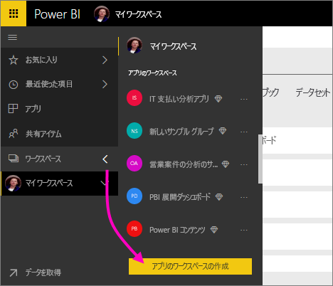
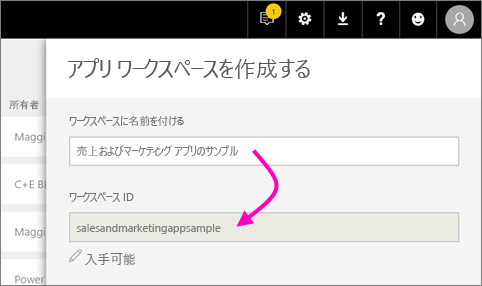
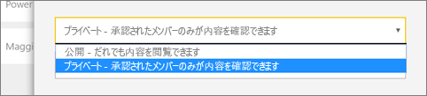
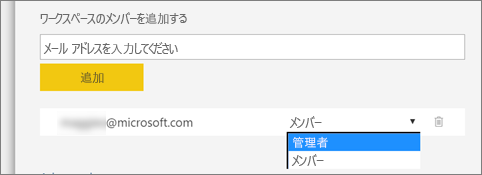
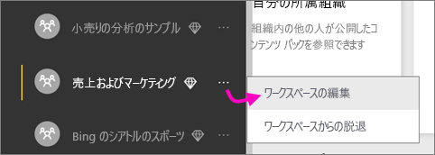

1. 最初に、ワークスペースを作成します。 **[ワークスペース]**  > **[アプリのワークスペースの作成]** の順に選択します。
   
     
   
    ここが、同僚と共同でコンテンツを配置する場所になります。
2. ワークスペースの名前を付けます。 対応する**ワークスペース ID** が使用できない場合は、一意の ID になるように編集します。
   
     これはアプリの名前にもなります。
   
     
3. 設定にはいくつかのオプションがあります。 **[パブリック]** を選択すると、組織内のすべてのユーザーがワークスペースの内容を表示できます。 一方、**[プライベート]** の場合、ワークスペースのメンバーしかその内容を表示できません。
   
     
   
    グループを作成した後は、公開/非公開を変更することはできません。
4. メンバーが**編集**可能かどうか、**表示専用**のアクセス許可を持つかどうかも選択できます。
   
     
   
     コンテンツを編集できるようにアプリ ワークスペースだけにユーザーを追加します。 コンテンツを表示するだけのユーザーの場合は、ワークスペースには追加しないでください。 そのユーザーは、アプリを発行するときに追加できます。
5. ワークスペースへのアクセス許可を与えるユーザーの電子メール アドレスを追加して、**[追加]** を選択します。 追加できるのは個別ユーザーのみで、グループのエイリアスは追加できません。
6. ユーザーごとにメンバーか管理者かを判断します。
   
     
   
    管理者は、他のメンバーの追加を含め、ワークスペース自体を編集できます。 メンバーは、表示専用のアクセス許可を持っていないかぎり、ワークスぺースのコンテンツを編集できます。 管理者とメンバーの両方がアプリを発行できます。
7. **[保存]** を選択します。

Power BI でワークスペースが作成され、開きます。 メンバーであるワークスペースの一覧が表示されます。 管理者は、省略記号 (...) を選択すると、前の画面に戻って新しいメンバーの追加やアクセス許可の変更などの変更を加えることができます。

