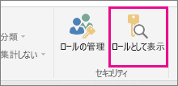
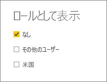
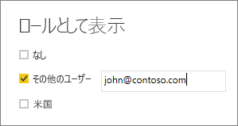

## Power BI Desktop 内でロールを検証する
ロールを作成したら、Power BI Desktop 内でロールの結果をテストします。

1.  **[ロールとして表示]** を選択します。 

    

    **[ロールとして表示]** に、作成したロールが表示されます。

    

3. 作成したロールを選択し、 **[OK]**  を選択して、そのロールを適用します。 レポートでは、そのロールに関連するデータがレンダリングされます。 

4. **その他のユーザー**を選択し、特定のユーザーを指定することもできます。 ユーザー プリンシパル名 (UPN) を、Power BI サービスおよび Power BI Report Server で使用されるものとして指定することをお勧めします。

    

1.  **[OK]**  を選択します。ユーザーに表示される内容に基づいてレポートがレンダリングされます。 

Power BI Desktop の **[その他のユーザー]** には、DAX 式に基づいた動的セキュリティを使用している場合、異なる結果のみが表示されます。 

