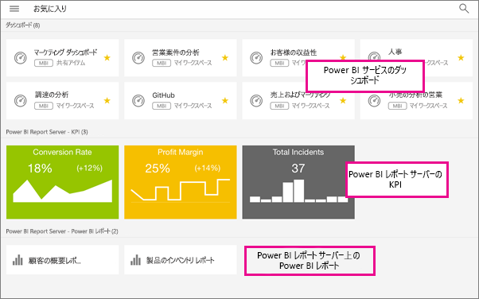

# Power BI モバイル アプリでダッシュボード、アプリ、オンプレミスのレポートをお気に入りに追加する
適用対象:

|  |  |  |  |  |
|:--- |:--- |:--- |:--- |:--- |
| iPhone |iPad |Android フォン |Android タブレット |Windows 10 デバイス |

モバイル アプリの [お気に入り] ページで、お気に入りの Power BI ダッシュボードとアプリ、お気に入りのオンプレミスの Microsoft Power BI Report Server および Reporting Services の KPI とモバイル レポートを表示することができます。 Power BI モバイル アプリでダッシュボードまたはアプリを "*お気に入り*" に追加すると、Power BI サービスの [お気に入り] ページ ([https://powerbi.com](https://powerbi.com)) およびすべてのモバイル デバイスに表示されます。 

また、[Power BI サービスで Power BI ダッシュボードとアプリをお気に入りに追加する](service-dashboard-favorite.md)こともできます。 お気に入りに追加したダッシュボードとアプリは、モバイル アプリの [お気に入り] ページに表示されます。

Power BI レポート サーバーまたは Reporting Services Web ポータルで KPI とレポートをお気に入りに設定し、Power BI のお気に入りのダッシュボードと共に、デバイスの便利なフォルダーで表示できます。

## お気に入りの Power BI ダッシュボードとアプリ、オンプレミスのレポートと KPI を表示する
* 上部のナビゲーション メニュー  をタップし、**[お気に入り]** をタップします。
  
  
  
  すべてのお気に入りが一緒にこのページに表示されます。
  
  

## アプリをお気に入りに追加する
1. モバイル アプリでアプリの一覧で、アプリの横にある省略記号 (...) をタップし、**[お気に入り]** をタップします。
   
    
   
    これで、その他のお気に入りのダッシュ ボードおよびアプリと一緒に一覧表示されます。
   
    

## iOS および Windows 10 モバイル アプリでダッシュボードをお気に入りにする
ダッシュボードの一覧またはダッシュボード自体から、Power BI ダッシュボードまたはアプリをお気に入りにすることができます。

* モバイル アプリのダッシュボードの一覧で、ダッシュボード名の横にある白抜きの星  をタップします。 星が黄色  に変わります。
  
    
* ダッシュボードで、上部のリボンにある白抜きの星  をタップします。 星が黄色  に変わります。
  
    

## Android モバイル アプリでダッシュボードをお気に入りにする
ダッシュボードの一覧またはダッシュボード自体から、ダッシュボードをお気に入りにすることができます。

* モバイル アプリのダッシュボードの一覧で、ダッシュボード名の横にある垂直線の省略記号 (...) をタップして、**[お気に入り]** をタップします。 名前の横に黄色い星  が表示されます。
  
    
* ダッシュボードで、上部のリボンにある白抜きの星  をタップします。 星が濃い灰色  に変わります。
  
    

## Power BI レポート サーバーおよび Reporting Services のレポートと KPI をお気に入りに登録する
Power BI モバイル アプリでは、お気に入りの Power BI レポート サーバーおよび Reporting Services のレポートと KPI を表示できますが、モバイル アプリでそれらをお気に入りに登録することはできません。 [Web ポータルでお気に入りとしてタグを付け](report-server/getting-around.md#tag-your-favorite-reports-and-kpis)ます。 

## 次の手順
* [Power BI のお気に入りのダッシュボード](service-dashboard-favorite.md) 
* わからないことがある場合は、 [Power BI コミュニティで質問してみてください](http://community.powerbi.com/)。

