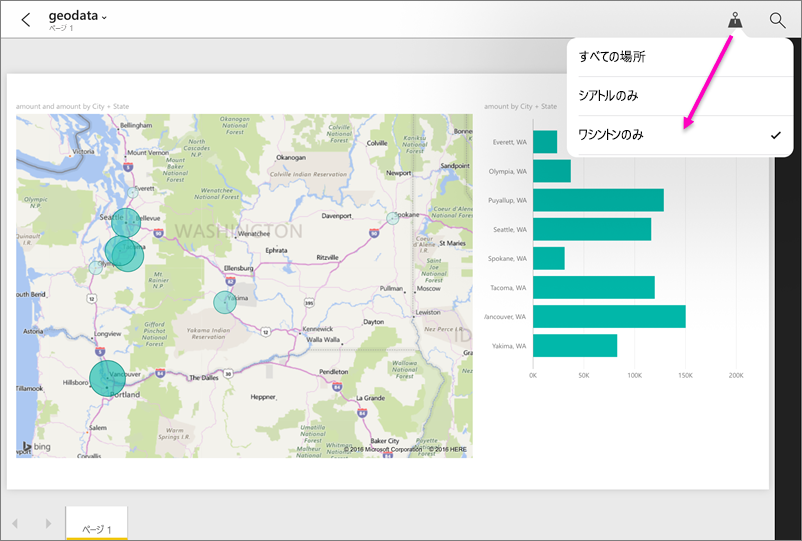

# Power BI モバイル アプリで地理的な場所によりレポートをフィルターする
適用対象:

|  |  |  |  |  |
|:--- |:--- |:--- |:--- |:--- |
| iPhone |iPad |Android フォン |Android タブレット |Windows 10 スマートフォン |

モバイル デバイスで Power BI レポートを開くと、右上に小さなプッシュピン アイコンが表示されることがあります。 プッシュピンが表示される場合、場所に基づいてそのレポートをフィルターできます。

> [!NOTE]
> 場所でフィルター処理できるのは、レポート内の地名が英語で書かれている場合のみです ("New York City"、"Germany" など)。 Windows 10 タブレットと PC は地理的なフィルタリングをサポートしていませんが、Windows 10 スマートフォンはサポートしています。
> 
> 

## 地理的な場所でレポートをフィルターする
1. モバイル デバイスの Power BI モバイル アプリでレポートを開きます。
2. レポートに地理的なデータが含まれている場合、Power BI に位置情報へのアクセスを許可するように求めるメッセージが表示されます。 **[許可]** をクリックし、もう一度 **[許可]** をタップします。
3. 押しピン . レポート内のデータに応じて、市、都道府県、または国/地域でフィルターすることができます。 フィルターを使用すると、現在地に一致する選択肢のみが一覧表示されます。
   
    

## レポートに場所タグが表示されない場合
場所タグが表示されるには、3 つの条件がすべて満たされている必要があります。 

* Power BI Desktop でレポートを作成したユーザーが、少なくとも 1 つの列に対して[地理データを分類](desktop-mobile-geofiltering.md)していること (市区町村、都道府県、国/地域など)。
* レポートを表示するユーザーが、列内にデータがある場所のいずれかにいること。
* レポートを表示するユーザーが、次のモバイル デバイスのいずれかを使っていること。
  * iOS (iPad、iPhone、iPod)。
  * Android フォンまたはタブレット。
  * Windows 10 スマートフォン (PC やタブレットなどの他の Windows 10 デバイスは、地理的フィルタリングをサポートしません)。

Power BI Desktop での[地理的なフィルターの設定](desktop-mobile-geofiltering.md)の詳細を参照してください。

### 次の手順
* [モバイル アプリで現実世界から Power BI データに接続する](mobile-apps-data-in-real-world-context.md)
* [Power BI Desktop でのデータ分類](desktop-data-categorization.md) 
* わからないことがある場合は、 [Power BI コミュニティで質問してみてください](http://community.powerbi.com/)。

