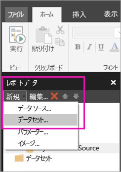
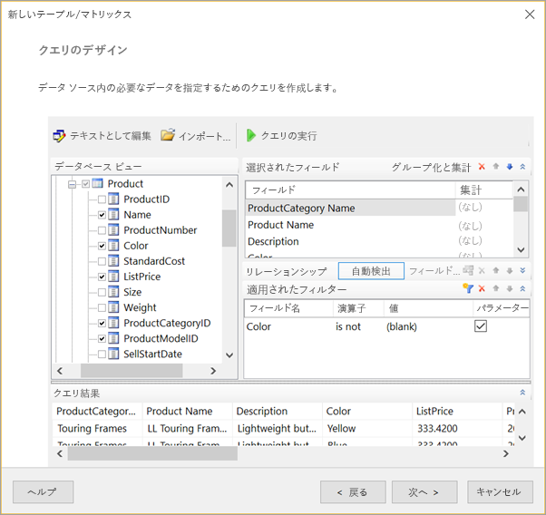
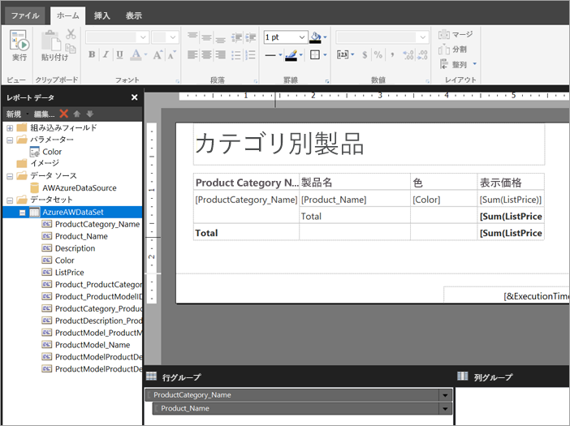

# Power BI サービスのページ分割されたレポート用の埋め込みデータセットを作成する (プレビュー)

この記事では、埋め込みデータ ソースに基づいて、Power BI サービスのページ分割されたレポート用の埋め込みデータセットを作成する方法について説明します。 埋め込みデータセットは、1 つのページ分割されたレポートに (そのレポートで使用するために) 含まれています。 現時点では、Power BI サービスに発行されるページ分割されたレポートには、埋め込みデータセットと埋め込みデータ ソースが必要です。 埋め込みデータ ソースとデータセットは、レポートの作成時にレポート ビルダーで作成します。 

データセットを作成する前にデータ ソースを作成する必要があります。 方法については、Power BI サービスの[ページ分割されたレポートの埋め込みデータ ソース](paginated-reports-embedded-data-source.md)に関するページを参照してください。
  
## 埋め込みデータセットを作成する
  
1. レポート ビルダーのレポート データ ペインで、**[新規作成]** > **[データセット]** を選択します。

1. **[データセットのプロパティ]** ダイアログ ボックスの **[クエリ]** タブで、データセットの名前を指定します。 埋め込みデータ ソースは既に **[データ ソース]** ボックスに表示されています。または、**[新規作成]** を選択して別の埋め込みデータ ソースを作成することもできます。
 
     

3. **[クエリの種類]** で、データセットに使用するコマンドまたはクエリの種類を選択します。 
    - **[テキスト]** では、データベースからデータを取得するクエリを実行します。 これが既定値であり、ほとんどのクエリに使用されます。 クエリを入力するか、**[インポート]** を選択して既存のクエリをインポートします。 クエリをグラフィカルに作成するには、**[クエリ デザイナー]** を選択します。 クエリ デザイナーを使用してクエリを作成する場合は、クエリのテキストがこのボックスに表示されます。 式を使用してクエリを動的に生成するには、**[式]** (**fx**) ボタンを選択します。 
    - **[テーブル]** では、テーブル内のすべてのフィールドを選択します。 データセットとして使用するテーブルの名前を入力します。
    - **[ストアド プロシージャ]** では、ストアド プロシージャを名前で実行します。

4. クエリ デザイナーでは、データセット内のテーブルとフィールドの参照および操作、クエリのインポート、またはテキストとしての編集を行うことができます。 ここでフィルターとパラメーターを追加することもできます。 

    

5. クエリ デザイナーで、**[クエリの実行]** を選択してクエリをテストし、**[OK]** を選択します。

1. [データセットのプロパティ] ダイアログ ボックスに戻り、**[タイムアウト (秒)]** ボックスにクエリがタイムアウトするまでの秒数を入力します。既定値は 30 秒です。 **[タイムアウト]** の値は、空または 0 より大きい数値にする必要があります。 空の場合、クエリはタイムアウトしません。

7.  その他のタブでは、データセットの他のプロパティを設定できます。
    - **[フィールド]** タブで計算フィールドを作成します。
    - **[オプション]** タブで詳細設定オプションを設定します。
    - **[フィルター]** タブと **[パラメーター]** タブで、それぞれフィルターとパラメーターを追加または更新します。

8. **[OK]** を選択します。
 
   レポートがレポート デザイン ビューで開きます。 データ ソース、データセット、およびデータセット フィールド コレクションがレポート データ ペインに表示され、ページ分割されたレポートのデザインを続行することができます。  

     
 
## 次の手順 

- [Power BI Premium のページ分割されたレポートとは(プレビュー)](paginated-reports-report-builder-power-bi.md)  
- [チュートリアル:ページ分割されたレポートを作成して Power BI サービスにアップロードする](paginated-reports-quickstart-aw.md)
- [ページ分割されたレポートを Power BI サービスに発行する](paginated-reports-save-to-power-bi-service.md)

