# チュートリアル:ページ分割されたレポートを作成して Power BI サービスにアップロードする (プレビュー)

このチュートリアルでは、サンプルの Azure SQL データベースに接続します。 ウィザードを使用する Power BI のレポート ビルダーで改ページ調整されたレポートを複数のページをラップするテーブルを作成します。 次に、Power BI サービスで Premium 容量のワークスペースにページ分割されたレポートをアップロードします。 Power BI サービスでのページ分割されたレポートは、現在プレビュー段階です。

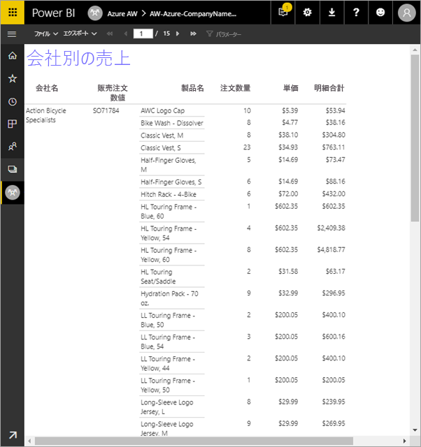

このチュートリアルで実行する手順を次に示します。

> [!div class="checklist"]
> * Azure のサンプル データベースを作成します。
> * ウィザードのヘルプで、Power BI のレポート ビルダーでマトリックスを作成します。
> * 各ページのタイトル、ページ番号、列見出しでレポートの書式を設定します。
> * 通貨の書式を設定します。
> * Power BI サービスにレポートをアップロードします。

Azure サブスクリプションをお持ちでない場合は、始める前に[無料アカウントを作成](https://azure.microsoft.com/free/?WT.mc_id=A261C142F)してください。
 
## 前提条件  

ページ分割されたレポートを作成するための前提条件を次に示します。

- インストール[Power BI のレポート ビルダー、Microsoft ダウンロード センターから](https://go.microsoft.com/fwlink/?linkid=2086513)します。 

- クイック スタート「[Azure portal で Azure SQL データベースを作成する](https://docs.microsoft.com/azure/sql-database/sql-database-get-started-portal)」に従います。 **[概要]** タブの **[サーバー名]** ボックスの値をコピーして保存します。Azure で作成したパスワードとユーザー名を憶えておきます。

ページ分割されたレポートを Power BI サービスにアップロードするための前提条件を次に示します。

- [Power BI Pro ライセンス](service-admin-power-bi-pro-in-your-organization.md)が必要です。
- [Power BI Premium 容量](service-premium-what-is.md)内のサービス上のアプリ ワークスペースが必要です。 ワークスペース名の横にダイヤモンド形のアイコン  が表示されます。

## ウィザードでマトリックスを作成する
  
1.  お使いのコンピューターから Power BI のレポート ビルダーを起動します。  
  
     **[作業の開始]** ダイアログ ボックスが開きます。  
  
     ![レポート ビルダーの [作業の開始]](media/paginated-reports-create-embedded-dataset/power-bi-paginated-get-started.png)
  
1.  左側のウィンドウで **[新しいレポート]** が選択されていることを確認し、右側のウィンドウで **[テーブルまたはマトリックス ウィザード]** を選択します。  
  
4.  **[データセットの選択]** ページで、 **[データセットを作成する]**  >  **[次へ]** の順に選択します。  

    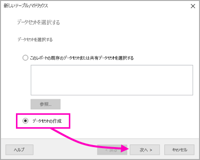
  
5.  **[データ ソースへの接続の選択]** ページで、 **[新規]** を選択します。 

    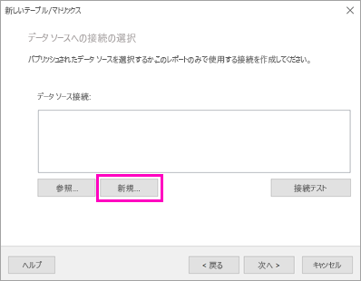
  
     **[データ ソースのプロパティ]** ダイアログ ボックスが開きます。  
  
6.  文字とアンダースコアを使用して、データ ソースに任意の名前を付けます。 このチュートリアルでは、 **[名前]** ボックスに「**MyAzureDataSource**」と入力します。  
  
7.  **[接続の種類の選択]** ボックスで、 **[Microsoft Azure SQL Database]** を選択します。  
  
8.  **[接続文字列]** ボックスの隣の **[構築]** を選択します。 

    ![[データ ソースのプロパティ] - [構築]](media/paginated-reports-quickstart-aw/power-bi-paginated-data-source-properties-build.png)

9. **Azure で:** Azure portal に戻り、 **[SQL データベース]** を選択します。

1. この記事の「**前提条件**」セクションで示したクイック スタート「Azure portal で Azure SQL データベースを作成する」で作成した Azure SQL データベースを選択します。

1. **[概要]** タブで、 **[サーバー名]** ボックスの値をコピーします。

2. **レポート ビルダーで**: **[接続プロパティ]** ダイアログ ボックスの **[サーバー名]** にコピーしたサーバー名を貼り付けます。 

1. **[サーバー ログオン]** で、 **[SQL Server 認証を使用する]** が選択されていることを確認し、サンプル データベース用に Azure で作成したユーザー名とパスワードを入力します。

1. **[データベースへの接続]** でドロップダウン矢印を選択し、Azure で作成したデータベース名を選択します。
 
    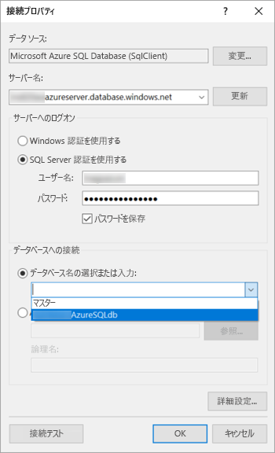

1. **[接続テスト]** を選択します。 **[テスト結果]** に "**接続テストに成功しました**" というメッセージが表示されます。

1. **[OK]**  >  **[OK]** の順に選択します。 

   **[接続文字列]** ボックスに、作成した接続文字列が表示されます。 

    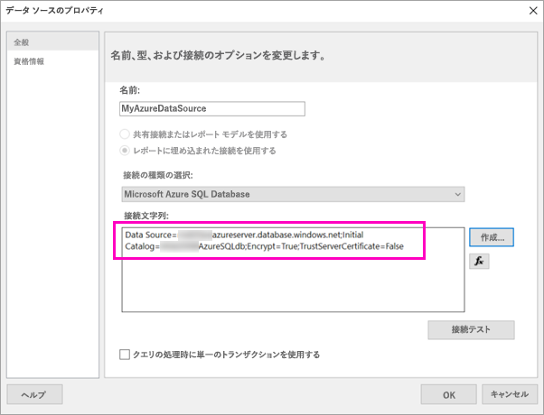

1. **[OK]** を選択します。
  
9. **[データ ソースへの接続の選択]** ページで、作成したデータ ソース接続の下に [(このレポートで)] と表示されます。 そのデータ ソースを選択し、 **[次へ]** を選択します。  

    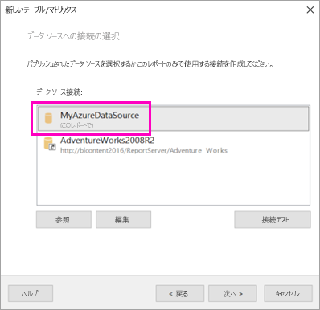

10. ボックスに同じユーザー名とパスワードを入力します。 
  
10. **[クエリのデザイン]** ページで、SalesLT を展開し、テーブルを展開して、次のテーブルを選択します。

    - 住所
    - 顧客
    - 製品
    - ProductCategory
    - SalesOrderDetail
    - SalesOrderHeader

     **[リレーションシップ]**  >  **[自動検出]** が選択されているので、レポート ビルダーによってこれらのテーブル間のリレーションシップが検出されます。 
    
    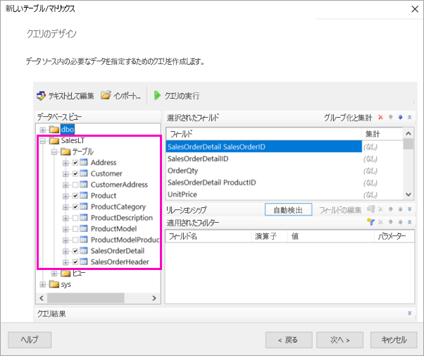
 
1.  **[クエリの実行]** を選択します。 レポート ビルダーで **[クエリ結果]** が表示されます。 
 
     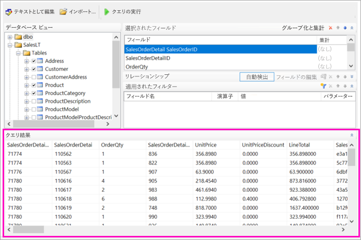

18. **[次へ]** を選びます。 

19. **[データセットの選択]** ページで、先ほど作成したデータセットを選択し、 **[次へ]** を選択します。

    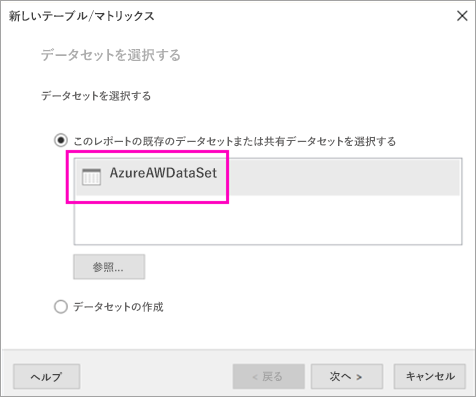

1. **[フィールドの配置]** ページで、以下のフィールドを **[使用できるフィールド]** ボックスから **[行グループ]** ボックスにドラッグします。

    - CompanyName
    - SalesOrderNumber
    - Product_Name

1. 以下のフィールドを **[使用できるフィールド]** ボックスから **[値]** ボックスにドラッグします。

    - OrderQty
    - UnitPrice
    - LineTotal

    レポート ビルダーで自動的に **[値]** ボックスのフィールドの合計が行われます。

    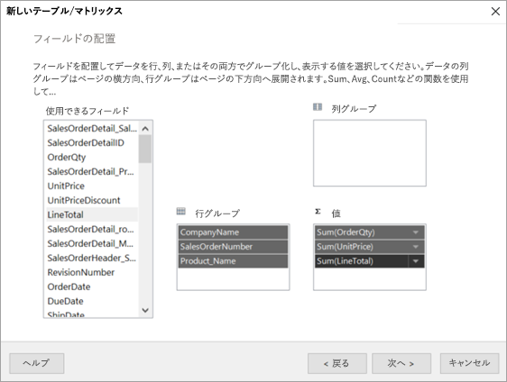

24. **[レイアウトの選択]** ページでは、すべての設定を既定のままにしますが、 **[グループの展開/折りたたみ]** はオフにします。 一般には、グループの展開/折りたたみ機能は優れていますが、ここではテーブルを複数のページにラップします。

1. **[次へ]**  >  **[完了]** の順に選択します。 テーブルがデザイン サーフェイスに表示されます。
 
## 作成したもの

いったん手を止めて、ウィザードの結果を見てみましょう。

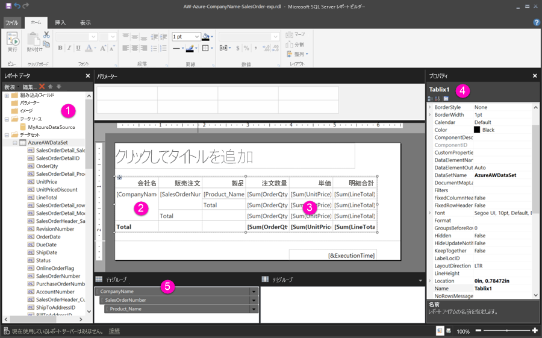

1. [レポート データ] ウィンドウには、埋め込まれた Azure データ ソースと、それに基づく埋め込まれたデータセット (どちらも作成したもの) が表示されます。 

2. デザイン サーフェイスの幅は約 6 インチです。 デザイン サーフェイスには、列見出しとプレースホルダー値を含むマトリックスが表示されています。 マトリックスには 6 つの列があり、5 行だけが表示されています。 

3. Order Qty、Unit Price、Line Total はすべて合計であり、各行グループには小計があります。 

    実際のデータ値はまだ表示されていません。 それらを表示するにはレポートを実行する必要があります。

4. [プロパティ] ウィンドウでは、Tablix1 というマトリックスが選択されています。 レポート ビルダーでの *tablix* は、行と列でデータが表示されるデータ領域です。 テーブルまたはマトリックスのいずれかにすることができます。

5. [グループ化] ウィンドウには、ウィザードで作成した 3 つの行グループが表示されています。 

    - CompanyName
    - 販売注文
    - 製品名

    このマトリックスには、列グループはありません。

### レポートを実行する

実際の値を表示するには、レポートを実行する必要があります。

1. **[ホーム]** ツール バーで **[実行]** を選択します。

   これで、値が表示されるようになります。 マトリックスには、デザイン ビューで表示されていたものよりはるかに多くの行があります。 レポート ビルダーでページが **[1**/**2?]** と表示されていることに注意してください。 レポート ビルダーでは可能な限り速やかにレポートが読み込まれるので、一度に読み込まれるのは数ページ分だけのデータです。 疑問符は、レポート ビルダーにすべてのデータがまだ読み込まれていないことを示します。

   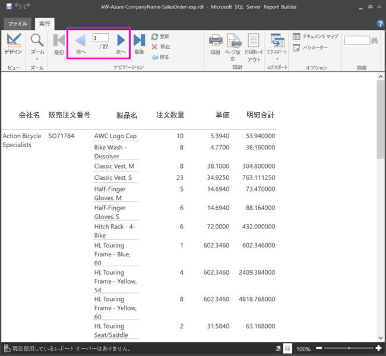

2. **[印刷レイアウト]** を選択します。 印刷時には、レポートはこの形式になります。 レポート ビルダーは、レポートが 33 ページであることを認識するようになっており、フッターに日付と時刻のスタンプを自動的に追加しています。

## レポートを書式設定する

現在、33 ページにラップするマトリックスを含むレポートがあります。 それでは、他の機能を追加し、見た目をもっとよくしてみましょう。 結果を確認したい場合は、すべてのステップの後でレポートを実行できます。

- リボンの **[実行]** タブで **[デザイン]** を選択し、変更を続けられるようにします。  

### ページの幅を設定する

通常、ページ分割されたレポートは印刷用に書式設定されており、一般的なページは 8 1/2 X 11 インチです。 

1. ルーラーをドラッグして、デザイン サーフェイスの幅を 7 インチにします。 既定の余白は各側とも 1 インチなので、横の余白を狭くする必要があります。

1. デザイン サーフェイスを囲む灰色の領域内をクリックすると、 **[レポート]** プロパティが表示されます。

    [プロパティ] ウィンドウが表示されない場合は、 **[表示]** タブの **[プロパティ]** をクリックします。

2. **[余白]** を展開し、 **[左]** と **[右]** を 1in から 0.75in に変更します。 

    
  
### レポートのタイトルを追加する  

1. ページの上部にある **[クリックしてタイトルを追加]** を選択し、「**Sales by Company**」と入力します。  

2. タイトルのテキストを選択し、[プロパティ] ウィンドウの **[フォント]** で、 **[色]** を **[青]** に変更します。
  
### ページ番号を追加する

レポートのフッターに日付と時刻のスタンプがあるのがわかります。 フッターにはページ番号も追加できます。

1. デザイン サーフェイス下端のフッターの右側に、[&ExecutionTime] と表示されています。 

2. [レポート データ] ウィンドウで、[組み込みフィールド] フォルダーを展開します。 **[ページ番号]** を、フッター左側の [&ExecutionTime] と同じ高さにドラッグします。

3. [&PageNumber] ボックスの右側をドラッグして、正方形にします。

4. **[挿入]** タブで **[テキスト ボックス]** を選択します。

5. [&PageNumber] の右側をクリックし、「of」と入力してから、テキスト ボックスを四角形にします。

6. **[全体的な総ページ数]** をフッターの "of" の右側にドラッグし、右側の境界をドラッグしてやはり正方形にします。

    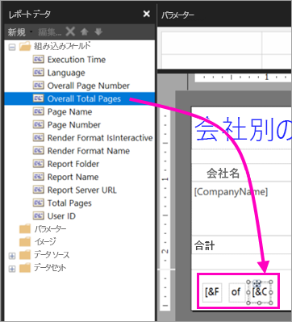

### テーブルを広くする  

今度は、マトリックスをページの幅いっぱいに広げて、名前があまり多くスクロールしないようにテキスト列の幅を広くします。 
 
1. マトリックスを選択し、Company Name 列を選択します。

3. マトリックス上部の Company Name 列の右端にある灰色のバーをポイントします。 列の終わりが 1 3/8 インチになるまで、右側にドラッグします。 

    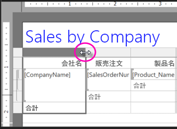

4. Product Name の右端を、列が 3 3/4 インチで終了するまでドラッグします。   

これで、マトリックスが印刷領域とほぼ同じ幅になりました。

### 通貨の書式を設定する

レポートを実行したときに気付いたかもしれませんが、金額がまだ通貨として書式設定されていません。

1. 左上の [Sum(OrderQty)] セルを選択し、Shift キーを押しながら、右下の [Sum(LineTotal)] セルを選択します。

    

2. **[ホーム]** タブでドル ( **$** ) の通貨記号を選択し、 **[プレースホルダーのスタイル]** の隣の矢印を選択して、 >  **[サンプルの値]** を選択します。
 
    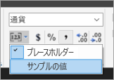

    値が通貨として書式設定されて表示されます。

    

### 各ページに列見出しを追加する

Power BI サービスにレポートを発行する前に、もう 1 つの書式改善として、レポートの各ページに列見出しが表示されるようにします。

1. [グループ化] ウィンドウの上部バーの右端で、ドロップダウン矢印を選択して、 **[詳細設定モード]** を選択します。

    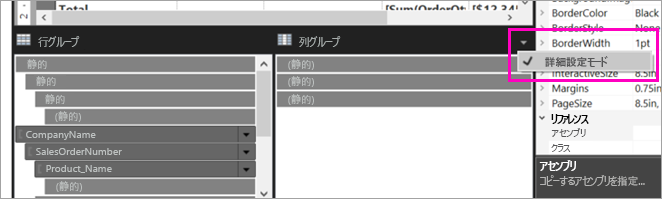

2. **[行グループ]** で、先頭の **[Static]** バーを選択します。 マトリックスで Company Name セルが選択されたことがわかります。

   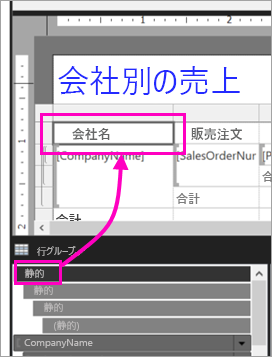

3. **[プロパティ]** ウィンドウには、 **[Tablix メンバー]** のプロパティが表示されています。 **[KeepWithGroup]** を **[後]** に設定し、 **[RepeatOnNewPage]** を **[True]** に設定します。

    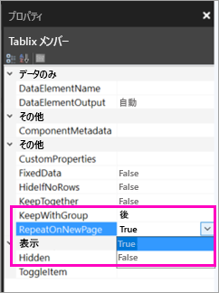

    レポートを実行して、どのようになったか確認します。

5. **[ホーム]** タブの **[実行]** を選択します。

6. まだ選択されている場合は、 **[印刷レイアウト]** を選択します。 レポートのページ数は 29 になっています。 何ページかスクロールします。 通貨が書式設定されており、すべてのページの列に見出しが付いており、ページ番号と日時スタンプを含むフッターがすべてのページに表示されることがわかります。
 
    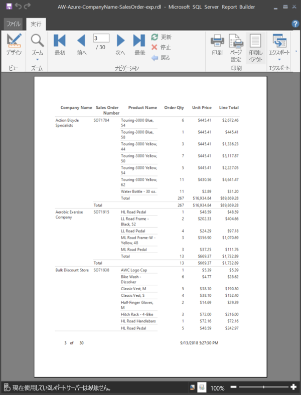

7. コンピューターにレポートを保存します。
 
##  レポートをサービスにアップロードする

このページ分割されたレポートの作成は済んだので、次に Power BI サービスにレポートをアップロードします。

1. Power BI サービス (http://app.powerbi.com) の左側のナビゲーションで、 **[ワークスペース]**  >  **[アプリのワークスペースの作成]** を選択します。

2. ワークスペースに、「**Azure AW**」または他の一意名を付けます。 今のところ、メンバーはまだ自分だけです。 

3. **[詳細設定]** の横にある矢印を選択して、 **[専用の容量]** をオンにします。 

    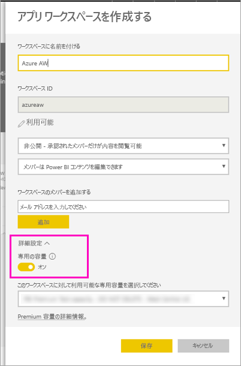

    オンにできない場合は、Power BI 管理者に依頼して、専用の Premium 容量にワークスペースを追加するためのアクセス許可を付与してもらう必要があります。

4. **[このワークスペースに対して利用可能な専用容量を選択する]** を選択し、必要な場合は **[保存]** を選択します。
    
    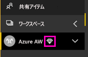

    ワークスペースが Premium 容量内にない場合は、レポートをアップロードしようとすると、"ページ分割されたレポートをアップロードできません" というメッセージが表示されます。 Power BI 管理者に連絡し、ワークスペースを移動してもらいます。

1. 新しいワークスペースで、 **[データを取得]** を選択します。

2. **[ファイル]** ボックスの **[取得]** を選択します。

3. **[ローカル ファイル]** を選択し、ファイルを保存した場所に移動して、 **[開く]** を選択します。

   Power BI によってファイルがインポートされ、アプリ一覧ページの **[レポート]** に表示されます。

    

4. レポートを選択して表示します。

5. エラーが発生する場合は、資格情報の再入力が必要な場合があります。 **[管理]** アイコンを選択します。

    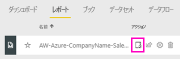

6. **[資格情報を編集]** を選択し、Azure データベースを作成するときに Azure で使用した資格情報を入力します。

    

7. ページ分割されたレポートを、Power BI サービスで表示できるようになります。

    

## 次の手順

[Power BI Premium のページ分割されたレポートとは(プレビュー)](paginated-reports-report-builder-power-bi.md)

