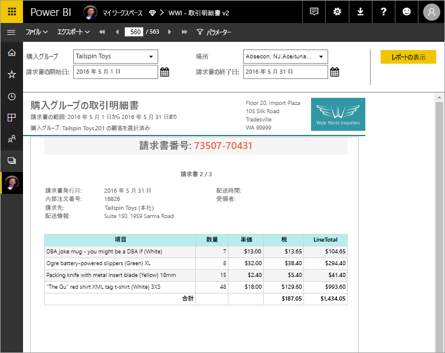

# Power BI Premium のページ分割されたレポートとは (プレビュー)
ページ分割されたレポート (SQL Server Reporting Services での標準レポート形式) を、Power BI サービスで使用できるようになりました。 ページ分割されたレポートは、印刷または共有することを想定してデザインされたレポートです。 "ページ分割された" と呼ばれるのは、ページにちょうど収まるように書式設定されていて、たとえばテーブルが複数のページにまたがる場合でも、テーブルのすべてのデータが表示されるためです。 レポート ページのレイアウトを厳密に制御できるため、"ピクセル単位で完璧" と呼ばれることもあります。 ページ分割されたレポートは、SQL Server Reporting Services の RDL レポート テクノロジに基づいています。 レポート ビルダーは、ページ分割されたレポートを作成するためのスタンドアロン ツールです。 

ページ分割されたレポートは、多くのページを含むことができます。 次の例のレポートは 563 ページあり、請求書ごとに 1 ページが使用されて、ヘッダーとフッターが繰り返されるように、正確にレイアウトされています。

レポート ビルダーでレポートをプレビューした後、Power BI サービス (http://app.powerbi.com) に発行することができます。 サービスにレポートを発行するには、Power BI Pro ライセンスが必要です。 ワークスペースが Power BI Premium 容量に存在する限り、マイ ワークスペースまたはアプリ ワークスペースにページ分割されたレポートを発行して共有できます。 また、Power BI 管理者は、Power BI 管理ポータルでページ分割されたレポートを有効にする必要があります。 詳しくは、[ワークロードの構成](service-admin-premium-manage.md#configure-workloads)に関するページをご覧ください。 

## レポート ビルダーでレポートを作成する

ページ分割されたレポートには、専用のデザイン ツールであるレポート ビルダーがあります。 Power BI Report Server または SQL Server Reporting Services (SSRS) 用のページ分割されたレポートを作成した場合は、同じツールと同じバージョンを使用できます。 実際、SSRS 2016 や 2017 または Power BI Report Server オンプレミス用に作成したページ分割されたレポートは、Power BI サービスと互換性があります。 Power BI サービスは下位互換性が維持されているので、レポートを上位バージョンに移行でき、以前のバージョンのページ分割されたレポートをアップグレードすることができます。 起動時には使用できないレポート機能があります。詳しくは、この記事の「[制限事項と考慮事項](#limitations-and-considerations)」をご覧ください。
     
## さまざまなデータ ソースからのレポート

1 つのページ分割されたレポートで、さまざまな異なるデータ ソースを使用できます。 Power BI レポートとは異なり、基になるデータ モデルはありません。 Power BI サービスでのページ分割されたレポートの初期リリースでは、共有データ ソースまたはサーバー上のデータセットに接続するのではなく、レポート自体にデータ ソースおよびデータセットを埋め込みます。 ローカル コンピューター上のレポート ビルダーでレポートを作成します。 レポートでオンプレミスのデータに接続する場合は、レポートを Power BI サービスにアップロードした後、ゲートウェイを作成し、データ接続をリダイレクトする必要があります。 最初のリリースで接続できるデータ ソースは次のとおりです。

- Azure SQL Database と Data Warehouse
- ゲートウェイ経由の SQL Server
- ゲートウェイ経由の SQL Server Analysis Services
 
他のデータ ソースについては、プレビュー期間中に対応されます。

## レポートをデザインする  

### マトリックス、グラフ、および自由形式レイアウトでページ分割されたレポートを作成する

列ベースのデータ向けのテーブル レポート、集約データ向けのマトリックス レポート (クロス集計レポートやピボットテーブル レポートなど)、グラフィカル データ向けのグラフ レポート、およびそれ以外のすべて向けの自由形式 "*リスト*" レポート (請求書など) を作成します。 
  
いずれかのレポート ビルダー ウィザードを使用して始めることができます。 テーブル、マトリックス、およびグラフのウィザードでは、埋め込みデータ ソース接続と埋め込みデータセットを作成する手順が示されます。 その後、フィールドをドラッグ アンド ドロップしてデータセット クエリを作成し、レイアウトとスタイルを選択して、レポートをカスタマイズします。  
  
マップ ウィザードでは、地図や幾何図形を背景として集計データを表示するレポートを作成します。 マップ データには、Transact-SQL クエリまたは Environmental Systems Research Institute, Inc. (ESRI) シェープファイルの空間データを使用できます。 Microsoft Bing マップ タイルの背景を追加することもできます。  

### レポートにさらに追加する

データのフィルター処理、グループ化、並べ替えを行って、または数式や式を追加して、データを変更します。 グラフ、ゲージ、スパークライン、インジケーターを追加して、データをビジュアル形式でまとめます。  パラメーターとフィルターを使用し、データをフィルター処理してビューをカスタマイズします。 外部コンテンツなど、画像や他のリソースを埋め込んだり参照したりします。  

レポート自体からすべてのテキスト ボックス、画像、テーブル、グラフまで、ページ分割されたレポート内のすべてのものには、レポートの外観を意図したとおりに設定できる一連のプロパティがあります。

## レポート定義の作成

ページ分割されたレポートを設計するとき、実際には "*レポート定義*" を作成します。 それにデータは含まれません。 それでは、データを取得する場所、取得するデータ、データを表示する方法を指定します。 レポートを実行すると、指定したレポート定義がレポート プロセッサによって取得されて、データが取得され、レポートのレイアウトと組み合わせることでレポートが生成されます。 レポート定義は、Power BI サービス http://app.powerbi.com のマイ ワークスペースまたは同僚と共有しているワークスペースにアップロードします。 レポート データ ソースがオンプレミスにある場合は、レポートをアップロードした後、ゲートウェイを経由するようにデータ ソース接続をリダイレクトします。 

## ページ分割されたレポートを表示する
ページ分割されたレポートは、ブラウザーの Power BI サービスまたは Power BI モバイル アプリで表示できます。 Power BI サービスでは、HTML、MHTML、PDF、XML、CSV、TIFF、Word、Excel など、Web 指向、ページ指向、デスクトップ アプリケーションのさまざまな形式にレポートをエクスポートできます。 他のユーザーと共有することもできます。  
  
## 制限事項と考慮事項

最初のリリースでは、次のような他のいくつかの機能がサポートされていません。

- レポート ページまたはビジュアルの Power BI ダッシュボードへのピン留め。
- ドキュメント マップや表示/非表示ボタンなどの対話機能。
- サブレポートとドリルスルー レポート。
- サブスクリプション。
- 共有データ ソースと共有データセット。
- Power BI データセット。
- Power BI レポートからのビジュアル。
- アプリでのページ分割されたレポート。 アプリ ワークスペースからページ分割されたレポートを共有することはできますが、そのワークスペースからアプリを発行するときにレポートを含めることはできません。
 
## 次の手順

- [Microsoft ダウンロード センターからレポート ビルダーをインストールする](http://go.microsoft.com/fwlink/?LinkID=734968)

- [チュートリアル: ページ分割されたレポートを作成する](paginated-reports-quickstart-aw.md)
  

